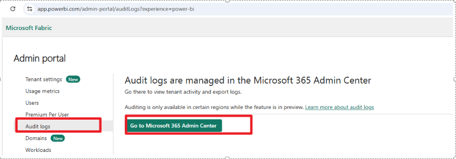

# Audit Log in Power BI and Microsoft Fabric

Audit logs enable users to track activities either from the Power BI/Fabric perspective (PBI audit log) or from the tenant perspective (unified audit log).

---

## Comparison: PBI Audit Log vs. Unified Audit Log

|                        | **PBI Audit Log**                                                                 | **Unified Audit Log**                                                                                 |
|------------------------|-----------------------------------------------------------------------------------|------------------------------------------------------------------------------------------------------|
| **Required Permissions** | At least the user must be a Power BI admin                                       | User must have audit permissions within the tenant                                                   |
| **Log Retention Period** | 30 days                                                                          | Changed from 90 days to 180 days ([Audit log activities \| Microsoft Learn](https://learn.microsoft.com/en-us/purview/audit-log-activities)) |
| **How to Retrieve Logs** | Via Power BI admin REST API:<br>[Admin - Get Activity Events - REST API (Power BI Power BI REST APIs) \| Microsoft Learn](https://learn.microsoft.com/en-us/rest/api/power-bi/admin/get-activity-events)<br>Or via PowerShell script:<br>[Track user activities in Power BI - Power BI \| Microsoft Learn](https://learn.microsoft.com/en-us/power-bi/enterprise/service-admin-auditing) | Via Power BI admin portal → Audit log<br><br>Or via PowerShell script:<br>[Track user activities in Microsoft Fabric - Microsoft Fabric \| Microsoft Learn](https://learn.microsoft.com/en-us/fabric/admin/track-user-activities) |


---

## PowerShell Scripts to Retrieve Audit Logs

### PBI Audit Log

- **Reference:** [Get-PowerBIActivityEvent (MicrosoftPowerBIMgmt.Admin) \| Microsoft Learn](https://learn.microsoft.com/en-us/powershell/module/microsoftpowerbimgmt.admin/get-powerbiactivityevent)
- **Sample Script:**
    ```powershell
    Install-Module -Name MicrosoftPowerBIMgmt
    # Define the start and end dates
    Login-PowerBI
    $startDate = [datetime]::Parse("2025-01-05")
    $endDate = [datetime]::Parse("2025-01-10")
    # Initialize an array to store all activities
    $allActivities = @()
    # Loop through each day between the start and end dates
    for ($date = $startDate; $date -le $endDate; $date = $date.AddDays(1)) {
        $formattedDate = $date.ToString("yyyy-MM-dd")
        $startDateTime = "$formattedDate" + "T00:00:00"
        $endDateTime = "$formattedDate" + "T23:59:59"
        # Get the activities for the current day
        $activities = Get-PowerBIActivityEvent -StartDateTime $startDateTime -EndDateTime $endDateTime -ActivityType 'CreateEmailSubscription' | ConvertFrom-Json
        # Add the activities to the array
        $allActivities += $activities
    }
    # Convert all activities to JSON format and save to a file
    $allActivities | ConvertTo-Json | Out-File -FilePath "C:\Carrie\auditemailsub2.json"
    ```

### Unified Audit Log

- **Reference:** [Search-UnifiedAuditLog (ExchangePowerShell) \| Microsoft Learn](https://learn.microsoft.com/en-us/powershell/module/exchange/search-unifiedauditlog)
- **Sample Script:**
    ```powershell
    Set-ExecutionPolicy RemoteSigned
    Install-Module -Name ExchangeOnlineManagement -RequiredVersion 3.3.0
    Import-Module ExchangeOnlineManagement
    Connect-ExchangeOnline -UserPrincipalName admin@M365x10636879.onmicrosoft.com
    Search-UnifiedAuditLog -StartDate 5/14/2024 -EndDate 5/26/2024 -RecordType PowerBIAudit -ResultSize 1000 | Export-Csv -Path "c:\Carrie\PowerBIAuditLog_Megan.csv" -NoTypeInformation
    # (You can replace the highlighted content to suit your environment)
    ```

---

*Use these methods to efficiently track and export user activity logs for auditing and compliance purposes in Power BI and Microsoft Fabric.*
