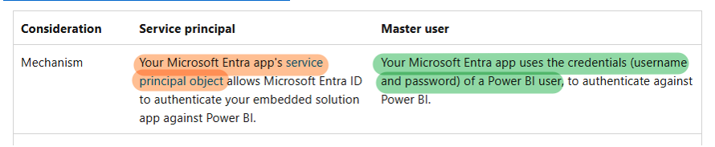
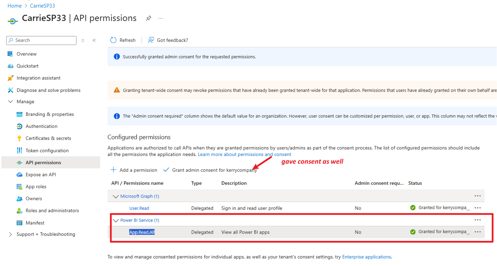
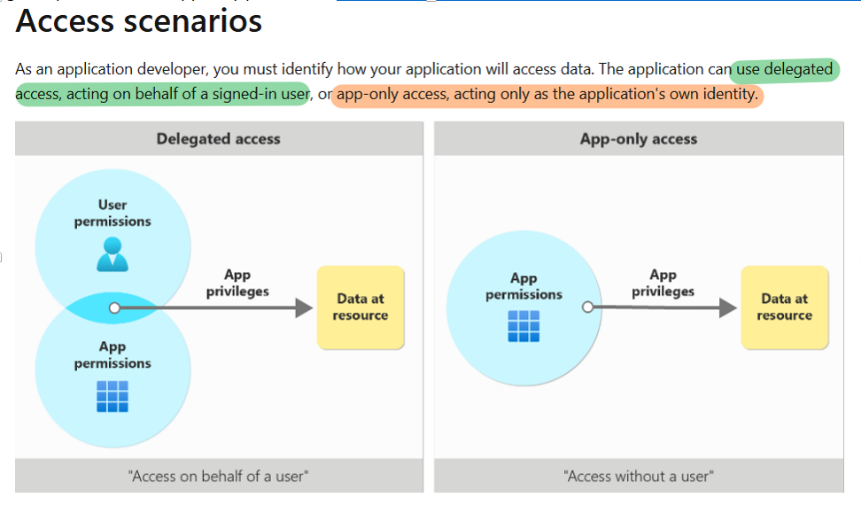

# Authenticating Power BI/Fabric API: Master User vs. Service Principal

## 1. Authentication Methods

To call the Power BI/Fabric API, you can authenticate using either a master user or a service principal. Both methods require a registered Azure Active Directory (AAD) application.  
Refer to: [Embed content in your Power BI embedded analytics application - Power BI | Microsoft Learn](https://learn.microsoft.com/en-us/power-bi/developer/embedded/embed-sample-for-customers)

---

## 2. Obtaining Access Tokens in Postman

### Using a Service Principal

To obtain an access token for a service principal in Postman, use the following parameters:

- **Request URL:** `GET https://login.microsoftonline.com/TENANTID/oauth2/token`
- **client_id:** `XXXX`
- **grant_type:** `client_credentials`
- **client_secret:** `XXXX`
- **resource:** `https://analysis.windows.net/powerbi/api`

### Using a Master User

For master user authentication, you must register the app and grant delegated permissions to allow the app to access resources on behalf of a user.

- Register an app in Azure portal.
- Configure the app's API permissions (delegated), e.g., `App.Read.All`.  See: [Apps - GetApps - REST API (Power BI Power BI REST APIs) | Microsoft Learn](https://learn.microsoft.com/en-us/rest/api/power-bi/apps/get-apps)

To get the access token, use:

- **Request URL:** `POST https://login.microsoftonline.com/TENANTID/oauth2/v2.0/token`
- **grant_type:** `password`
- **scope:** `https://analysis.windows.net/powerbi/api/App.Read.All`
- **username:** `XXXX@onmicrosoft.com`
- **password:** `XXXXX`
- **client_id:** `XXXXX`

---

## 3. Delegated Permission vs. App-Only Permission

Refer to: [Overview of permissions and consent in the Microsoft identity platform | Microsoft Learn](https://learn.microsoft.com/en-us/azure/active-directory/develop/permissions-consent-overview)

- **Delegated permission:** Used with master user to get access token for a resource app.
- **App-only permission:** Used with service principal to get access token for a resource app.

---

## 4. Demo: Permissions Needed to Call REST API

|                        | Using service principal                                                                                                                        | Using master user                                                                                   |
|------------------------|-----------------------------------------------------------------------------------------------------------------------------------------------|-----------------------------------------------------------------------------------------------------|
| **app**                | Access without a user                                                                                                                         | Access on behalf of a user                                                                          |
| **permission**         | App only permission                                                                                                                           | Delegated permission                                                                                |
| **Call REST API**      | • add SP to security group, allow security group to call REST API (enable tenant settings) • Add workspace permission member or admin | For normal API, need to grant corresponding API permission mentioned in each official doc in scope section. |
| **Call admin rest api**| Allow sp to call fabric/power bi admin rest api (via tenant settings)                                                                         | need Tenant.Read.All or Tenant.ReadWrite.All                                                        |

---

*Choose the appropriate authentication method and permissions based on your scenario to securely access Power BI/Fabric APIs.*
