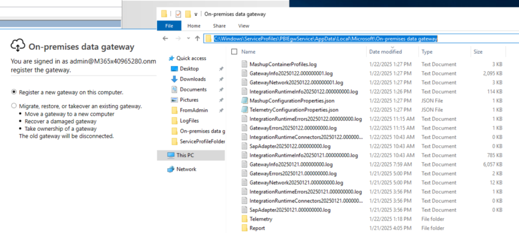
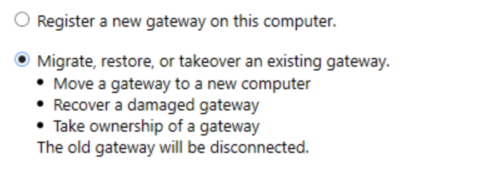

# Case Study: Gateway Needs to Be Re-Registered

This case study describes troubleshooting steps for an on-premises data gateway that appears offline in Power BI Service and requires re-registration on the gateway machine.

---

## Symptom

- The on-premises data gateway shows as offline in Power BI Service.
- The gateway app on the gateway machine indicates that the gateway needs to be re-registered.

## Cause

- The `gateway.bin` file was removed from the gateway machine.

## Resolution Steps

After deleting the gateway.bin file under the service account folder (C:\Windows\ServiceProfiles\PBIEgwService\AppData\Local\Microsoft\On-premises data gateway), user will have to register the GW as below.

#### Method 1: Restore the Gateway

- We could restore the Gateway and it will help auto generate the gateway.bin file which contains the key under the folder. The generated key is different from the previous one.  
   

#### Method 2: Restore from Backup bin file

- If we have a backup of the latest `gateway.bin` file, copy it back to the folder above. This will restore the gateway to online status.

## Important Notes

- If an incorrect `gateway.bin` file is used (where the key does not match the gateway), the gateway will show: `"gateway is configured and unable to be reached due to local network connectivity"`

---

By following these steps, you can resolve issues related to gateway registration and restore connectivity for Power BI on-premises data gateway.
