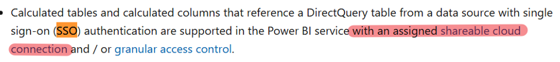
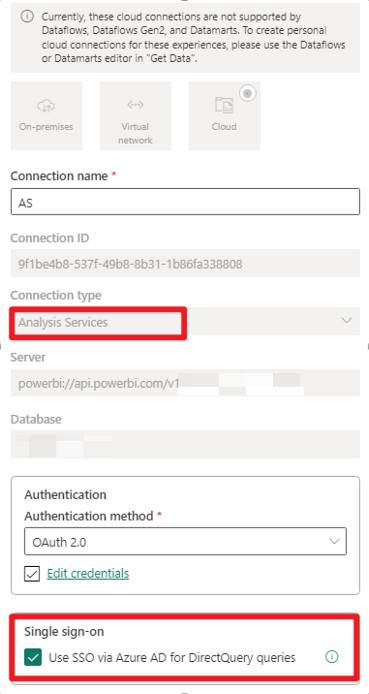
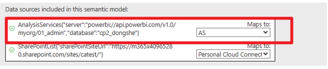

# Case Study: Refresh Failure Due to Calculated Columns in Power BI

## Symptom

When attempting to refresh the semantic model, the following error is displayed:

```
Data source error: {"error":{"code":"Premium_ASWL_Error","pbi.error":{"code":"Premium_ASWL_Error","parameters":{},"details":[{"code":"Premium_ASWL_Error_Details_Label","detail":{"type":1,"value":"We cannot refresh this dataset because the dataset contains calculated tables or calculated columns based on data from a Single Sign-on (SSO)-enabled Direct Query data source. Please configure the dataset to use an explicit connection with granular access control to access this data source and then try again."}}],"exceptionCulprit":1}}}
```

## Cause

By default, when connecting to a semantic model, Power BI uses a Live connection. If the model is loaded into PBI, it then becomes a DirectQuery connection, which by design uses SSO.  

Dataset refresh will fail if the dataset contains calculated tables or calculated columns based on data from a DirectQuery source that is connected to another semantic model.


## Recommendation

To resolve this issue, refer to: [Use composite models in Power BI Desktop - Power BI | Microsoft Learn](https://learn.microsoft.com/en-gb/power-bi/transform-model/desktop-composite-models#working-with-a-composite-model-based-on-a-dataset-or-model)

This scenario is supported only when using an assigned shareable cloud connection and/or granular access control.



As for detailed steps:

1. **Create a Shareable Cloud Connection for the Data Source**

   - For the semantic model data source, create a cloud connection using **Analysis Services** as the connection type.
   - Enable the option: **Use SSO via Azure AS for DirectQuery queries**.

   

2. **Use the Shareable Cloud Connection**

   - Assign this shareable cloud connection to the semantic model data source instead of using a personal cloud connection.

   

---

*By following these steps, you can resolve refresh failures caused by calculated tables or columns in datasets using SSO-enabled DirectQuery sources.*
