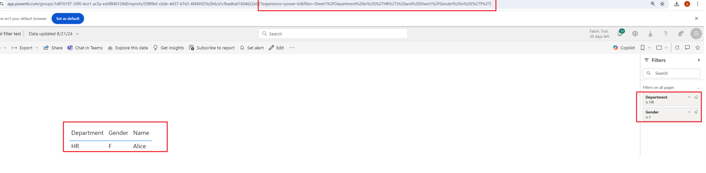
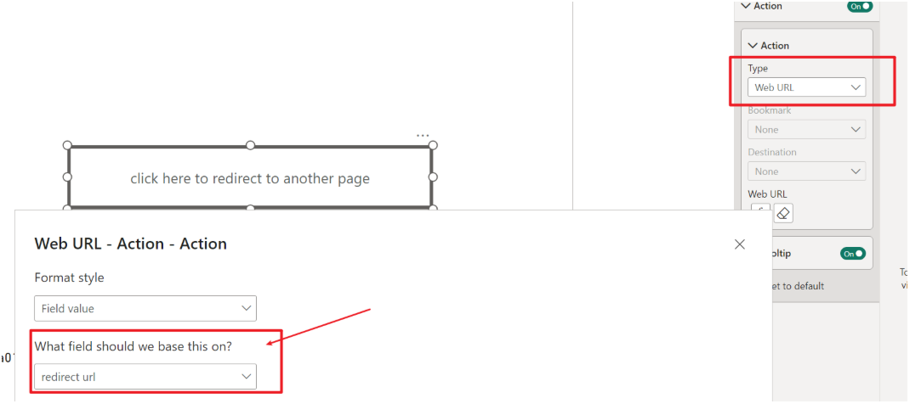
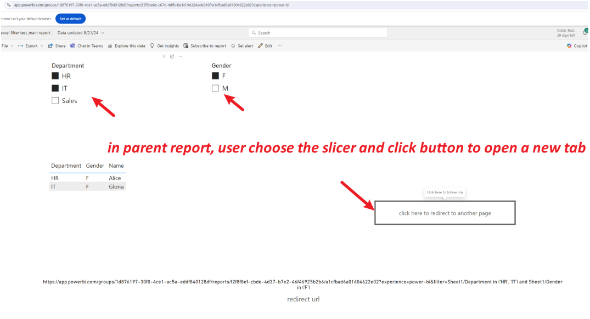
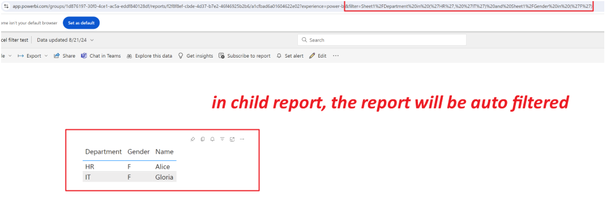

# Case Study: Jump to Sub-Report with URL Filtering in Power BI

## Requirement

How can parameters be passed when navigating between reports, allowing users to open a new report in a separate browser tab with filters applied?

## Recommended Solution

### 1. Filter the Child Report via URL Query String

In the target report (child report), you can filter the report by appending query string parameters to the URL.  
Refer to: [Filter a report with a URL query string parameter - Power BI | Microsoft Learn](https://learn.microsoft.com/zh-cn/power-bi/collaborate-share/service-url-filters)

For example, add a string such as `&filter=Sheet1/Department in ('HR', 'IT') and Sheet1/Gender in ('F')` to the report URL to pass filter information to the child report:

```
https://app.powerbi.com/groups/1d876197-30f0-4ce1-ac5a-eddf840128df/reports/f2f8f8ef-cbde-4d37-b7e2-46f46925b2b6/a1cfbad6a01604622e02?experience=power-bi&filter=Sheet1/Department in ('HR', 'IT') and Sheet1/Gender in ('F')
```



### 2. Dynamically Generate the URL in the Main Report

In the main report, you can create a measure to dynamically construct the URL based on slicer selections. Example DAX measure:

```dax
redirect url = 
VAR slicer1 = IF(
    ISFILTERED('Sheet1'[Department]), 
    "Sheet1/Department in (" & 
    CONCATENATEX(ALLSELECTED('Sheet1'[Department]), "'" & 'Sheet1'[Department] & "'", ", ") & 
    ")",
    BLANK()
)
VAR slicer2 = IF(
    ISFILTERED('Sheet1'[Gender]), 
    "Sheet1/Gender in (" & 
    CONCATENATEX(ALLSELECTED('Sheet1'[Gender]), "'" & 'Sheet1'[Gender] & "'", ", ") & 
    ")",
    BLANK()
)
VAR combinedSlicers = 
    IF(
        slicer1 <> BLANK() && slicer2 <> BLANK(), 
        slicer1 & " and " & slicer2, 
        slicer1 & slicer2
    )
RETURN
"https://app.powerbi.com/groups/1d876197-30f0-4ce1-ac5a-eddf840128df/reports/f2f8f8ef-cbde-4d37-b7e2-46f46925b2b6/a1cfbad6a01604622e02?experience=power-bi&filter=" & combinedSlicers
```

Create a button in the main report and set its action to "Web URL", binding it to the measure above.




### 3. User Experience

When users select parameters in the main report and click the button, a new tab opens with the child report, automatically filtered according to the selected parameters.

- **Parent report:** User selects slicers and clicks the button to open a new tab.

  

- **Child report:** The report is automatically filtered based on the parameters passed in the URL.

  

---

*This approach enables seamless navigation between reports with context-specific filtering, improving user experience and report interactivity in Power BI.*
