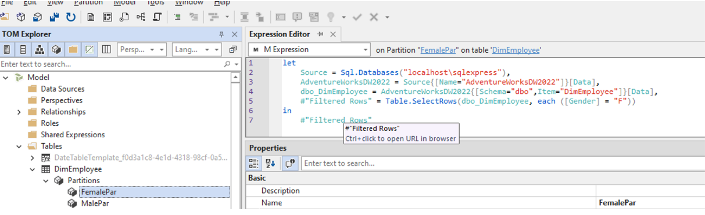
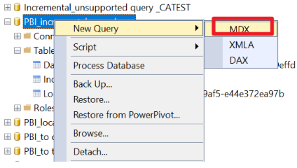
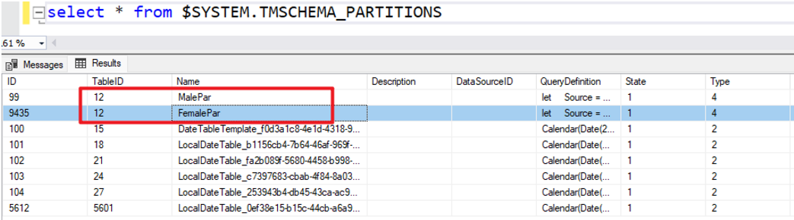
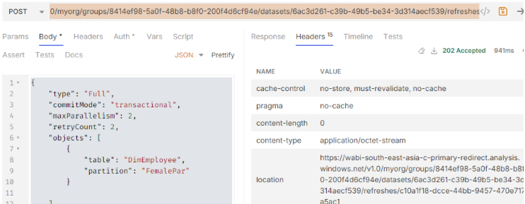
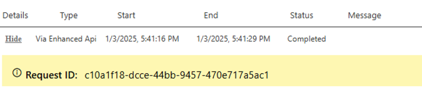

# Creating Custom Partitions in Power BI Semantic Models

We can create partitions using the `RangeStart` and `RangeEnd` parameters when configuring incremental refresh for a semantic model. Additionally, we can leverage Tabular Editor to define custom partitions and use the enhanced refresh API to refresh specific partitions as needed.

---

## Demo: Custom Partition Creation

1. **Connect Tabular Editor to Premium Analysis Services via XMLA Endpoint**  
   For detailed steps, refer to [Incremental-refresh-bootstrap.md](Incremental-refresh-bootstrap.md).

2. **Create Partitions and Specify Filter Conditions**  
   You can create new partitions under the "Partitions" section. In this example, two partitions are created based on the `Gender` column (F or M). The queries can be simplified and copied from Power Query Editor.

   **Female Partition**
   ```powerquery
   let
       Source = Sql.Databases("localhost\sqlexpress"),
       AdventureWorksDW2022 = Source{[Name="AdventureWorksDW2022"]}[Data],
       dbo_DimEmployee = AdventureWorksDW2022{[Schema="dbo",Item="DimEmployee"]}[Data],
       #"Filtered Rows" = Table.SelectRows(dbo_DimEmployee, each ([Gender] = "F"))
   in
       #"Filtered Rows"
   ```

   **Male Partition**
   ```powerquery
   let
       Source = Sql.Databases("localhost\sqlexpress"),
       AdventureWorksDW2022 = Source{[Name="AdventureWorksDW2022"]}[Data],
       dbo_DimEmployee = AdventureWorksDW2022{[Schema="dbo",Item="DimEmployee"]}[Data],
       #"Filtered Rows" = Table.SelectRows(dbo_DimEmployee, each ([Gender] = "M"))
   in
       #"Filtered Rows"
   ```

   

3. **Save and Refresh**  
   Ensure the capacity is enabled for XMLA read/write. Save changes in Tabular Editor and refresh the dataset in Power BI Service.

4. **Verify Partitions in SSMS**  
   In SQL Server Management Studio (SSMS), you can verify the partitions by running an MDX query against the dataset:

   ```sql
   select * from $SYSTEM.TMSCHEMA_PARTITIONS
   ```

   
   


## Demo: Refresh Partitions via Enhanced Refresh API

Refer to: [Enhanced refresh with the Power BI REST API - Power BI | Microsoft Learn](https://learn.microsoft.com/en-us/power-bi/connect-data/asynchronous-refresh)

1. **Send Enhanced Refresh Request**  
   Use the following POST request to refresh only the `FemalePar` partition:

   ```
   POST https://api.powerbi.com/v1.0/myorg/groups/8414ef98-5a0f-48b8-b8f0-200f4d6cf94e/datasets/6ac3d261-c39b-49b5-be34-3d314aecf539/refreshes
   ```

   **Request body (JSON):**
   ```json
   {
       "type": "Full",
       "commitMode": "transactional",
       "maxParallelism": 2,
       "retryCount": 2,
       "objects": [
           {
               "table": "DimEmployee",
               "partition": "FemalePar"
           }
       ]
   }
   ```

   

2. **Result in Power BI Service**  
   In Power BI Service, you will see a record of the enhanced refresh API operation, and only the rows in the `FemalePar` partition will be refreshed.

   
