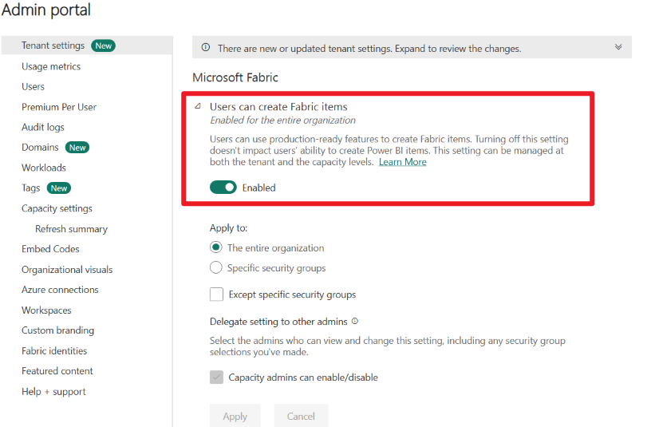
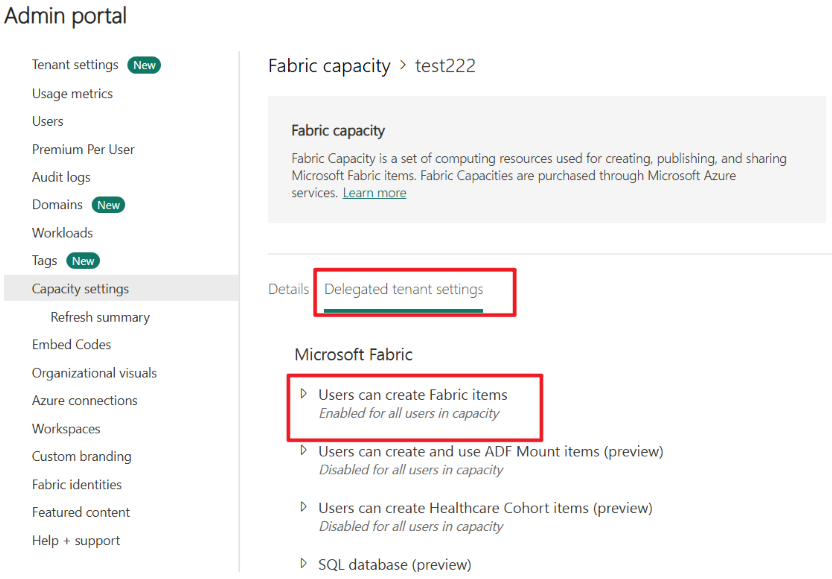

# Fabric License and Tenant Settings Prerequisites

## 1. License Prerequisites

- To create a non-Power BI Fabric item, the workspace must reside on a supported Fabric capacity.  
  For more information, see [Microsoft Fabric license types](https://learn.microsoft.com/en-us/fabric/enterprise/licenses#microsoft-fabric-license-types).
- To create a Power BI item, the user must have the appropriate license.  
  For more information, see [Microsoft Fabric license types](https://learn.microsoft.com/en-us/fabric/enterprise/licenses#microsoft-fabric-license-types).

---

## 2. Tenant Settings Prerequisites

### Tenant Setting: Users Can Create Fabric Items

Refer to: [Enable Microsoft Fabric for your organization - Microsoft Fabric | Microsoft Learn](https://learn.microsoft.com/en-us/fabric/admin/fabric-switch)

At the **tenant level**, administrators can enable or restrict the ability for users to create Fabric items.

---

At the **capacity level**, settings can inherit from or override the corresponding tenant setting.

