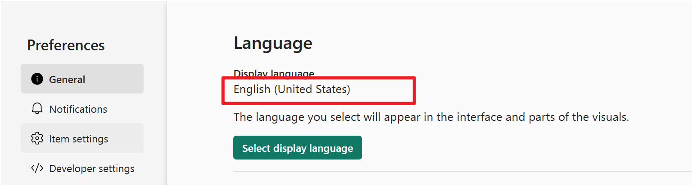
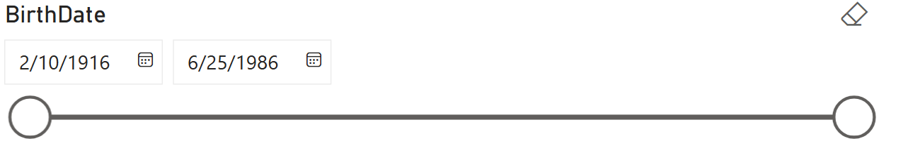
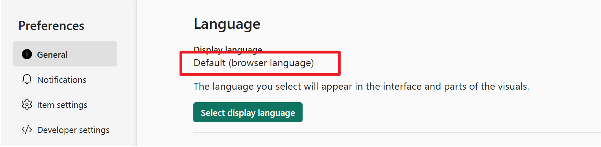
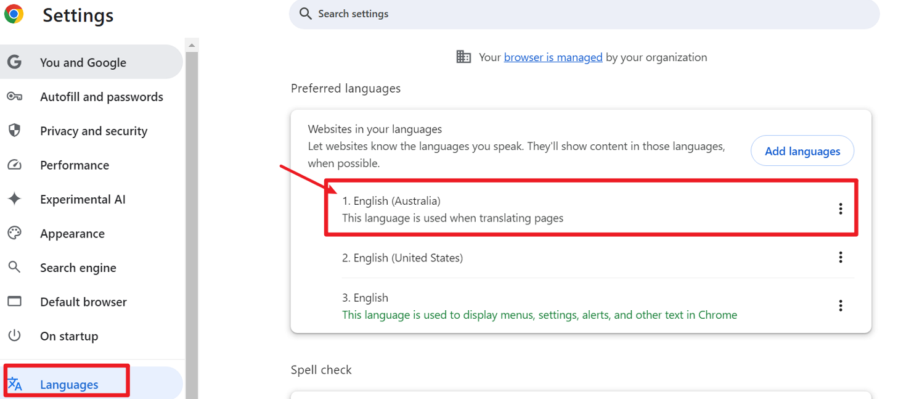
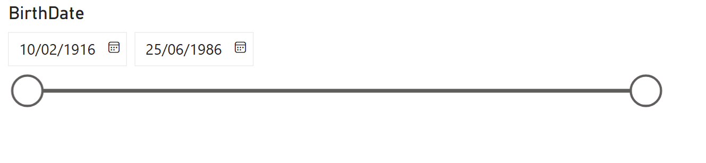
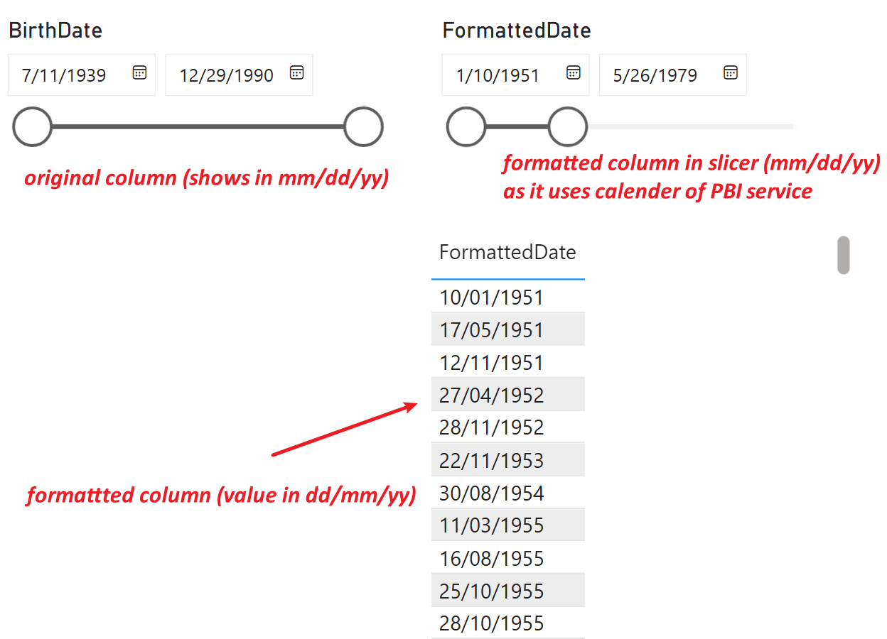

# Date Format in Power BI Service

Power BI Service displays date formats based on language and regional settings. Understanding how to control date formats is important for ensuring a consistent user experience.

---

## MM/DD/YY Format (English - United States)

- The MM/DD/YY format is standard for English (United States).
- In Power BI Service, set the display language to **English (United States)** to use this format.



then we could see the date is displayed in MM/DD/YY format in PBI service.




## DD/MM/YY Format (English - Australia)

- The DD/MM/YY format is standard for English (Australia).
- Power BI Service does not provide a direct option for English (Australia) in its language settings.
- To use this format, we could first set PBI service to use default browser language and then  set your browser's default language to **English (Australia)**.




then we could see the date is displayed in DD/MM/YY format in PBI service.




## Alternative: Use DAX FORMAT Function

If we do not want to change the browser language, we can format dates directly in Power BI using DAX:

```dax
FormattedDate = FORMAT([BirthDate], "dd/mm/yy")
```

This approach allows us to display dates in the desired format regardless of the service or browser language settings.



---

*By configuring language settings or using DAX formatting, you can control how dates are displayed in Power BI Service to meet your regional requirements.*
