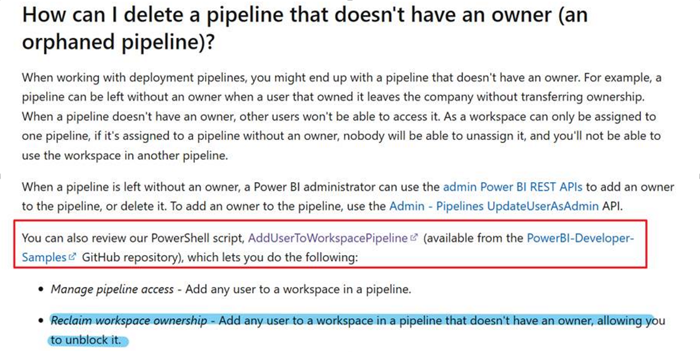
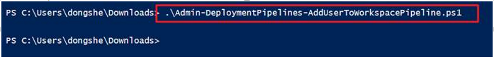

# Deleting Orphaned Pipelines in Power BI

## Scenario

**Question:**  
How can you determine which pipeline a specific workspace is assigned to when the pipeline owner is absent?

**Answer:**  
You can use a PowerShell script to assign the pipeline (associated with the workspace) to a user, even if you do not know the exact pipeline. This approach helps reclaim access and manage orphaned pipelines efficiently.

For more details, refer to:  
[Troubleshoot deployment pipelines, the Power BI Application lifecycle management (ALM) tool - Microsoft Fabric | Microsoft Learn](https://learn.microsoft.com/en-us/fabric/cicd/troubleshoot-cicd#how-can-i-delete-a-pipeline-that-doesn-t-have-an-owner--an-orphaned-pipeline--)

---

## Example: Using PowerShell to Reclaim Pipeline Ownership

The PowerShell script [`AddUserToWorkspacePipeline`](https://github.com/microsoft/PowerBI-Developer-Samples/blob/master/PowerShell%20Scripts/Admin-DeploymentPipelines-AddUserToWorkspacePipeline) allows you to:

- **Manage pipeline access:** Add any user to a workspace in a pipeline.
- **Reclaim workspace ownership:** Assign any user to a workspace in a pipeline that does not have an owner, enabling you to unblock and manage the pipeline.

Below is a screenshot of a local test result using the script:

