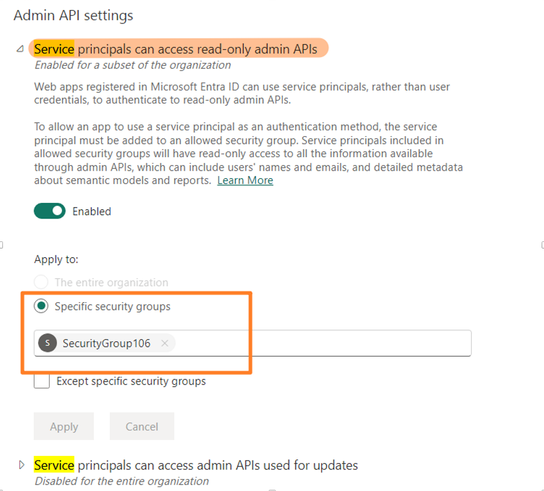
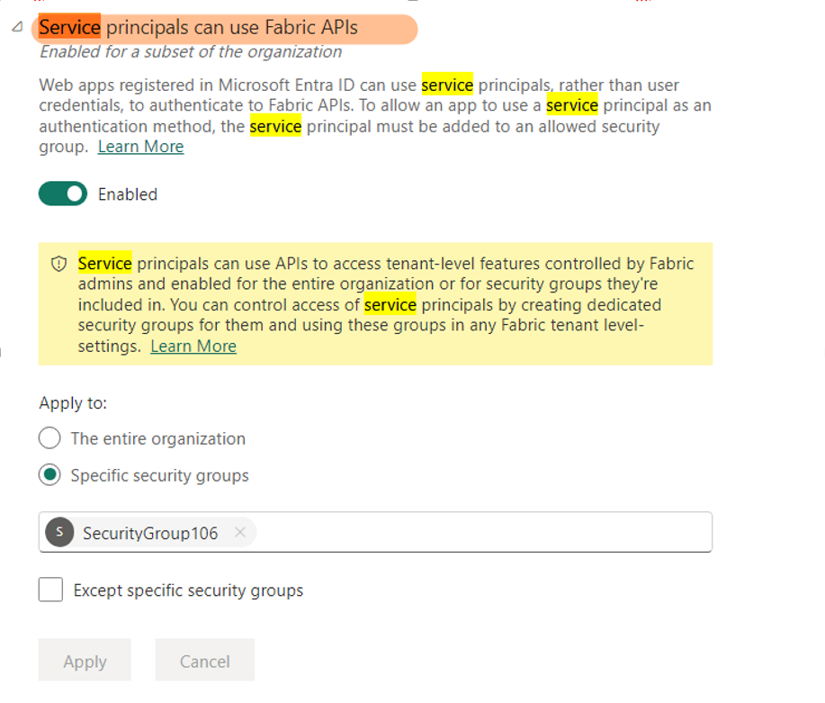

# Calling Admin and REST APIs with Service Principal in Power BI

## Calling Admin REST API

1. **Add the Service Principal (SP) to a Security Group and Enable Tenant Settings**  
   Assign the service principal to a security group and enable the relevant tenant settings for this group. Note that a separate setting is required for POST requests.

   

2. **Application Permission Considerations**  
   If application permissions are granted in the Azure portal under either of the following scenarios, a "Power BI Not authorized" exception will occur:  
   - When using service principal authentication, the app must not have any admin-consent required permissions for Power BI assigned in the Azure portal.

3. **Run the REST API**  
   After configuration, you can directly call the REST API.

---

## Calling REST API (Non-Admin)

1. **Add the Service Principal to a Security Group and Enable Settings**  
   Assign the service principal to a security group and enable the required settings. Do not enable for the entire organization, as this will cause authentication to fail.

   

2. **Add the Security Group to the Workspace Access List**  
   Ensure the security group is added to the workspace access list.

3. **Run the REST API**  
   In this scenario, there is no need to configure additional API permissions.

---

*By following these steps, you can securely and effectively use service principals to call both Admin and standard REST APIs in Power BI.*
