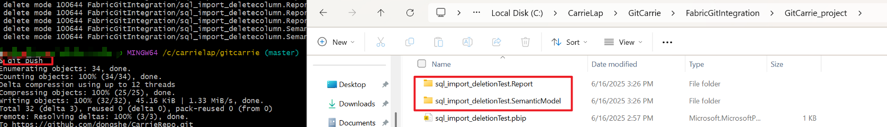
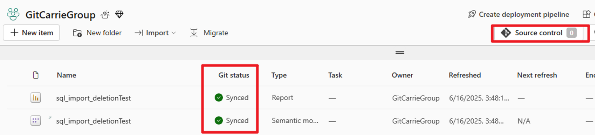
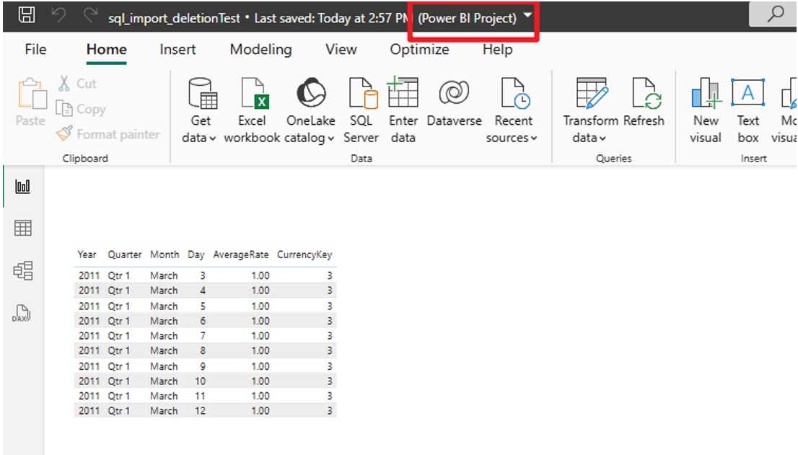
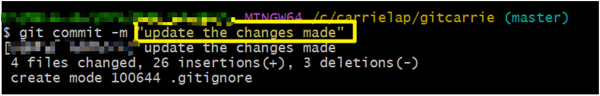
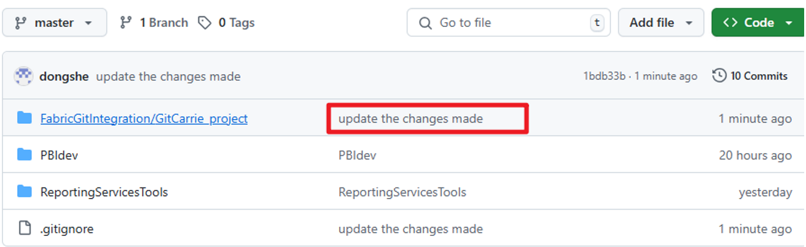
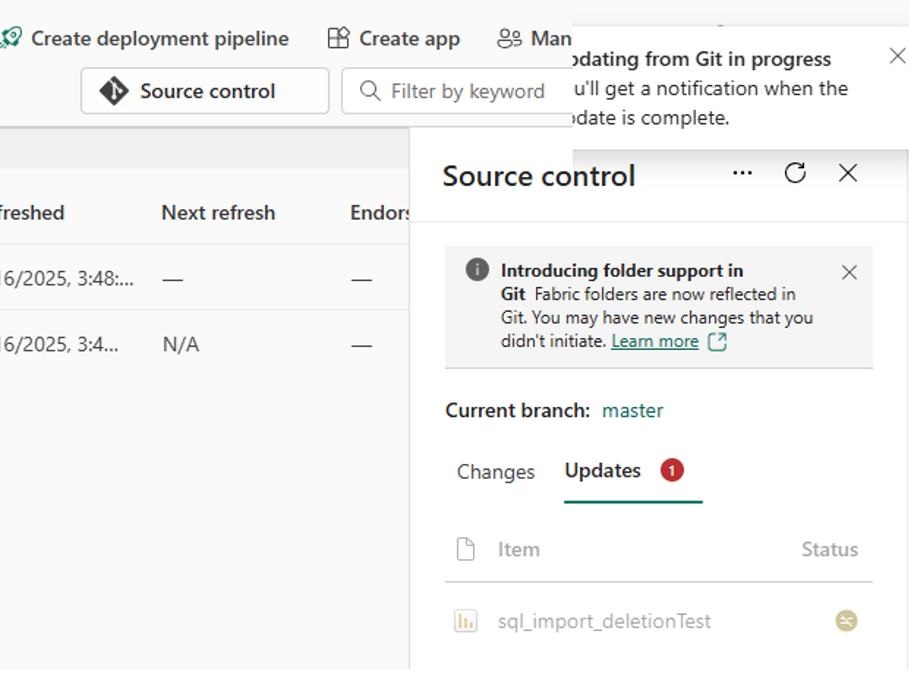
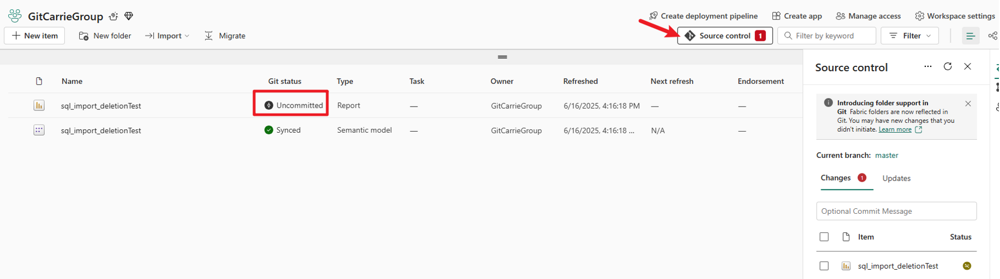
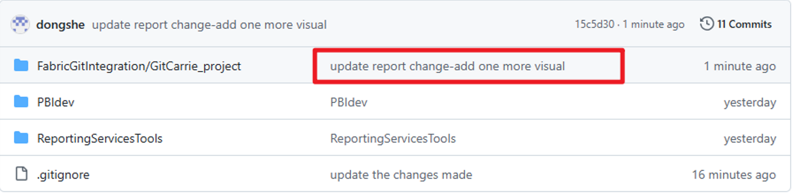
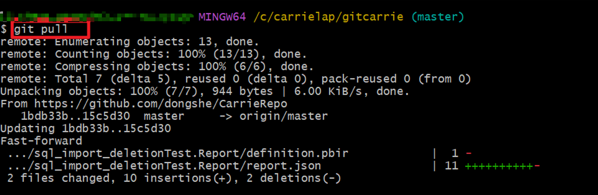

# Fabric Git Integration

## Preparation

1. In Power BI Desktop, create a report and save it as a `.pbip` file. This will save the report and semantic model in separate folders. Push updates from your local Git repository to a remote Git service such as Azure DevOps or GitHub.

   

2. Connect your Git repository to a Fabric workspace. The report and semantic model will then be synchronized to the Power BI workspace.  
   Refer to: [Get started with Git integration - Microsoft Fabric | Microsoft Learn](https://learn.microsoft.com/en-us/fabric/cicd/git-integration/git-get-started?tabs=azure-devops%2CAzure%2Ccommit-to-git)

   

---

## Scenario 1: Changes Made in Power BI Desktop

1. Make changes in Power BI Desktop (open the `.pbip` file), such as adding a new page.

   

2. Git will track changes applied to the report and dataset folders.

   

3. Commit and push the changes from local Git to GitHub:
   ```sh
   git commit -m "update the changes made"
   git push
   ```

   

4. In the Power BI service, source control will detect the changes. Use the "Source control" feature (under the Updates tab) to update the workspace with the latest changes.

   

---

## Scenario 2: Changes Made in Power BI Service

1. Make changes to the report in the Power BI service, such as adding a new visual. Source control will detect that changes have been made in the service but not yet committed to GitHub (visible under the Changes tab)

   

2. after we apply/commit the changes, GitHub will be updated with the new changes.

   

4. Use `git pull` to synchronize updates from GitHub to your local Git repository:
   ```sh
   git pull
   ```

   

5. Open the `.pbip` file in Power BI Desktop to see the updates reflected locally.


