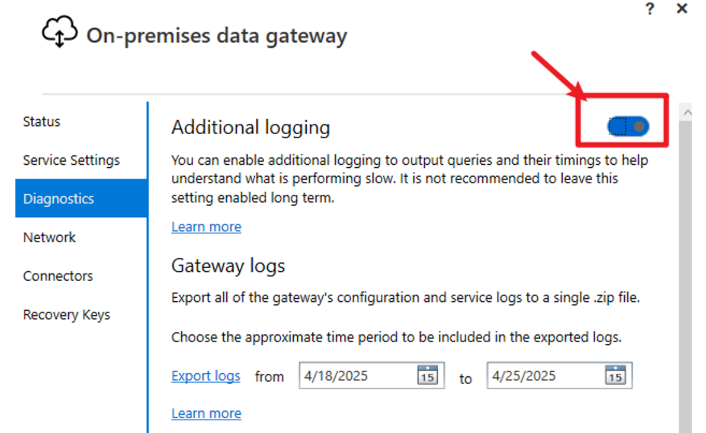

# Gateway Log Collection Guide

This guide provides step-by-step instructions for collecting and troubleshooting on-premises data gateway logs in Power BI environments.

---

## Collecting Gateway Logs

By default, additional logging is not enabled for the gateway. Standard logs such as gateway info, network, and error logs are generated automatically. Enabling additional logging allows the gateway to capture mashup logs, which are essential for diagnosing refresh issues—especially those related to data reading operations.

1. Launch the on-premises gateway application.
2. Go to the **Diagnostics** tab and enable **Additional logging**.

   

3. Click **Apply**. You will need to restart the gateway for changes to take effect.
4. Sign in to the gateway.
5. Reproduce the issue you want to capture.
6. Return to **Diagnostics** and choose **Export logs**.
7. If the exported folder does not contain a `mashup2022XXXX.000XXX.log` file, check the following directories for mashup logs:
   - `C:\Windows\ServiceProfiles\PBIEgwService\AppData\Local\Microsoft\On-premises data gateway`
   - `C:\Users\(username)\AppData\Local\Microsoft\On-premises data gateway`


## Gateway Configuration: Mashup Log Retention

by default, there will only be 20 mashup logs saved. To increase the number of mashup logs retained, update the value for `MashupLogMaximumNumberOfFiles` in below file. After making changes, restart the gateway.
```
C:\Program Files\On-premises data gateway\Microsoft.PowerBI.DataMovement.Pipeline.GatewayCore.dll.config
```


## Handling Overwritten Logs

If gateway logs are overwritten (for example, if a refresh lasts more than 5 hours), use the following commands to copy logs before they are overwritten:

- for gateway service account being a domain user account:
  ```
  Robocopy "C:\Users\dongshe\AppData\Local\Microsoft\On-premises data gateway" "e:\powerbi" *.log /mot:5
  ```
- for gateway service account being default NT service account:
  ```
  Robocopy "C:\Windows\ServiceProfiles\PBIEgwService\AppData\Local\Microsoft\On-premises data gateway" "e:\powerbi" *.log /mot:5
  ```

## Additional Resources

- To monitor gateway performance, we could use this customer-facing pbit to analyze the gateway logs. [Monitor and optimize on-premises data gateway performance | Microsoft Learn](https://learn.microsoft.com/en-us/data-integration/gateway/service-gateway-performance)

- To grant full control to the virtual service account (domain user account) for a local folder, such as NT Service\PBIEgwService, we could use below command prompt
  ```
  icacls "E:\Cases\2206230040001602" /grant "NT SERVICE\PBIEgwService":F /t
  ```
