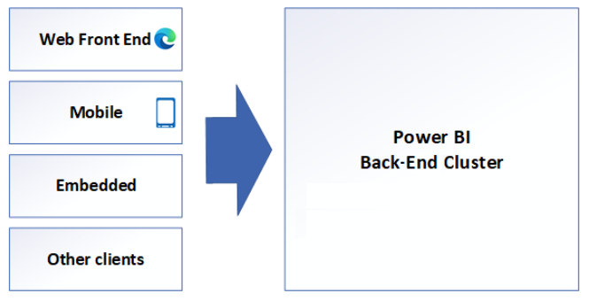
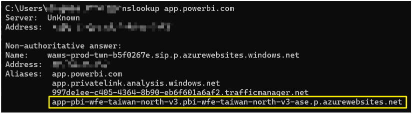

# Get Power BI Web Front-End (WFE) Information

## PBI Service Architecture

Power BI service is delivered as Software as a Service (SaaS). It is deployed across multiple datacenters worldwide, with numerous active deployments available to customers in each region, and corresponding passive deployments serving as backups.  
For more details, see: [Power BI security white paper - Power BI | Microsoft Learn](https://learn.microsoft.com/en-us/power-bi/guidance/white-paper-powerbi-security)



---

## WFE (Web Front-End) Overview

The Web Front-End (WFE) cluster provides the user's browser with the initial HTML page content upon site load, as well as pointers to Azure Content Delivery Network (CDN) resources used to render the site in the browser.

---

## How to Retrieve WFE Information

To obtain WFE information:

1. On the client machine, open a command prompt.
2. Run the following command:
   ```
   nslookup app.powerbi.com
   ```
3. The output will include several CNAME records, including the WFE information. For example:
   ```
   app-pbi-wfe-taiwan-north-v3.pbi-wfe-taiwan-north-v3-ase.p.azurewebsites.net
   ```


