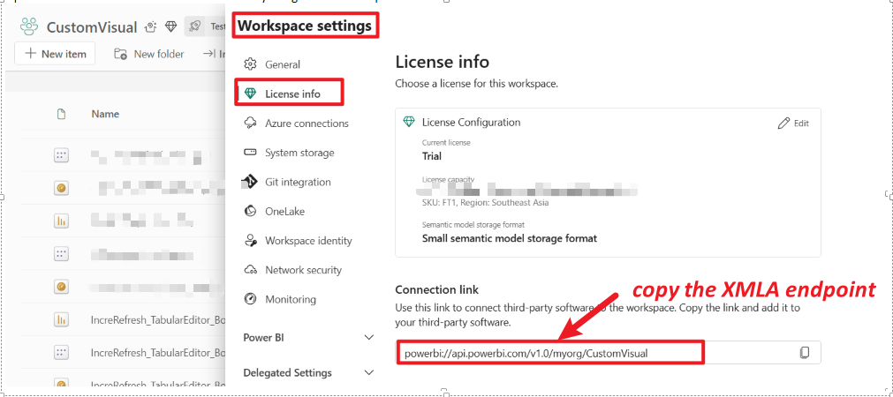
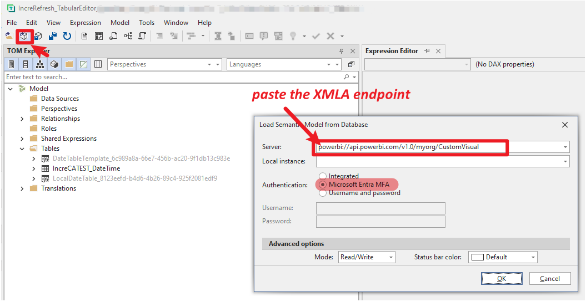
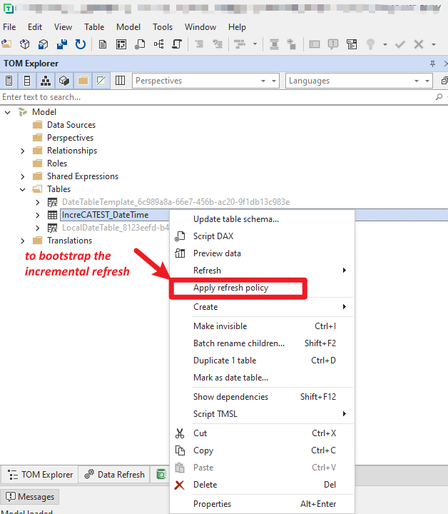
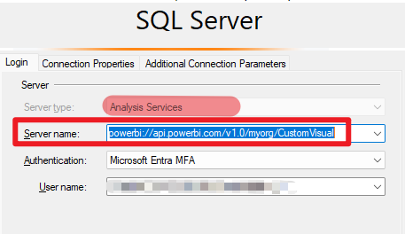
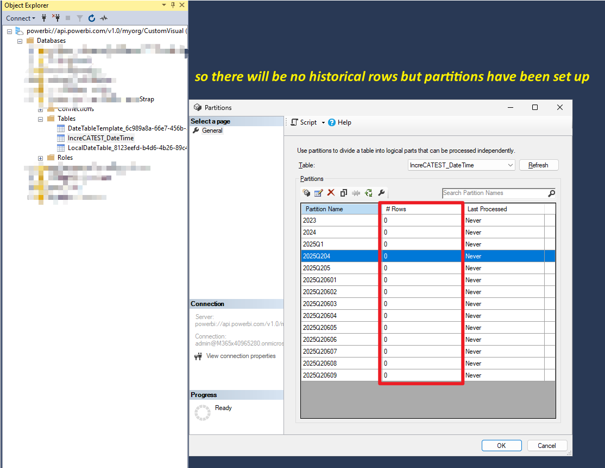
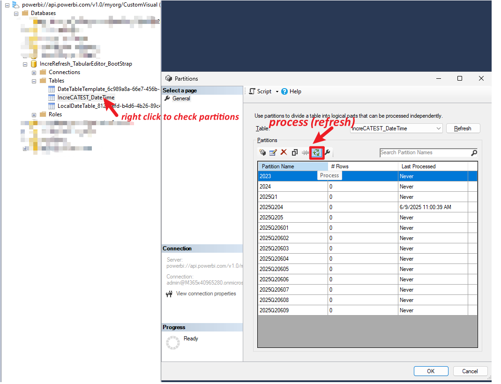

# Incremental Refresh Bootstrap in Power BI

## Background
For some models that load and process large amounts of data, the amount of time the initial refresh operation takes can exceed the refresh time limit imposed by the service or a query time limit imposed by the data source. Bootstrapping the initial refresh operation allows the service to create partition objects for the incremental refresh table, but not load and process historical data into any of the partitions.

**Refer:**  
[Advanced incremental refresh and real-time data with the XMLA endpoint in Power BI - Power BI | Microsoft Learn](https://learn.microsoft.com/en-us/power-bi/connect-data/incremental-refresh-xmla)

---

## Steps

1. **Define incremental refresh policy in PBID and then publish the report into PBI service workspace.**

   

2. **Open Tabular Editor and connect to the model by using the XMLA endpoint in Read/Write mode.**

   

3. **Run Apply Refresh Policy on the incremental refresh table to bootstrap the incremental refresh.**

   

4. **Connect with SSMS to refresh the partitions sequentially or in batches to load and process the data.**

   
   
   

---

*Follow these steps to bootstrap incremental refresh for large Power BI models efficiently.*
