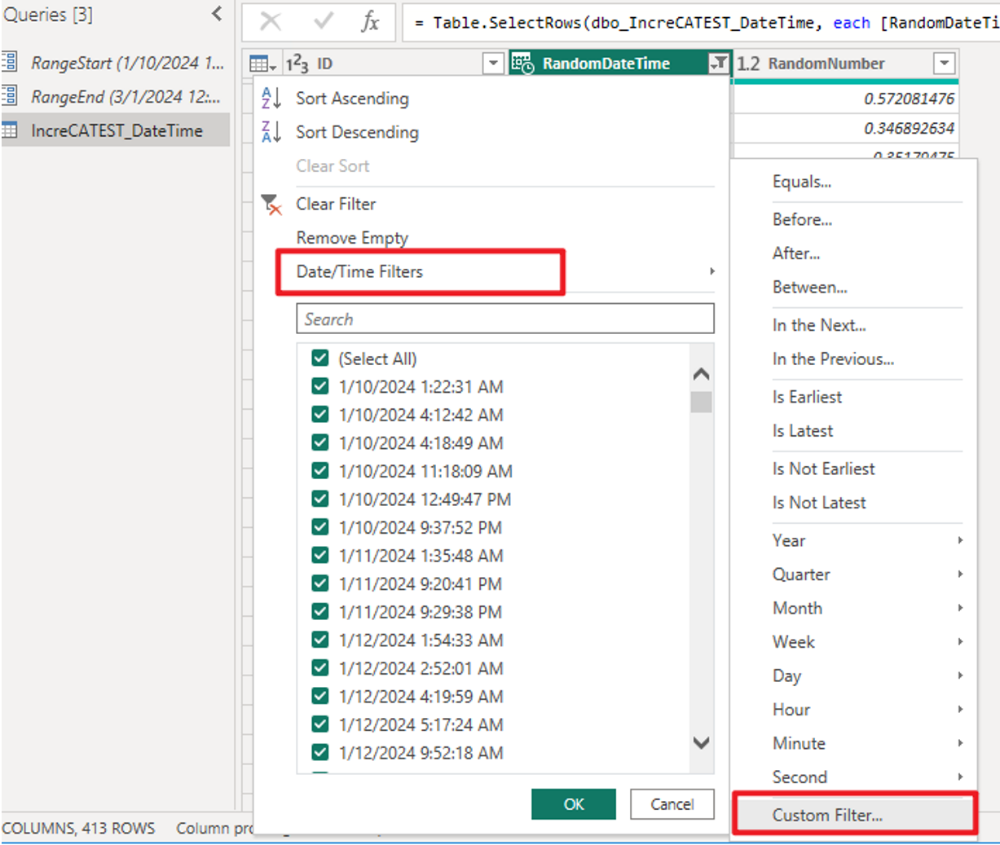
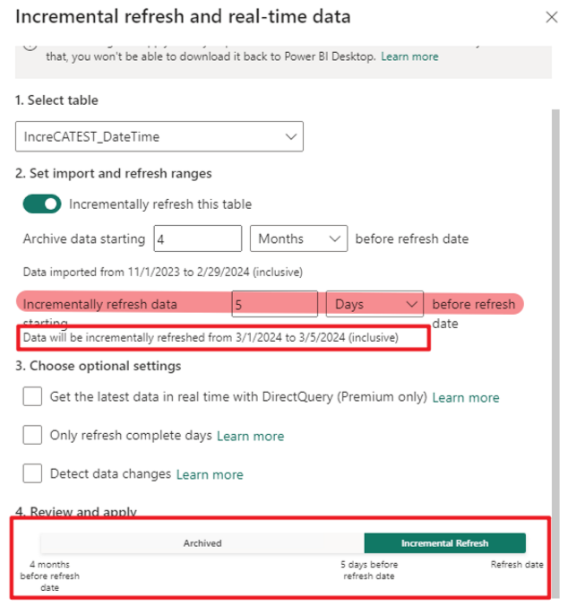
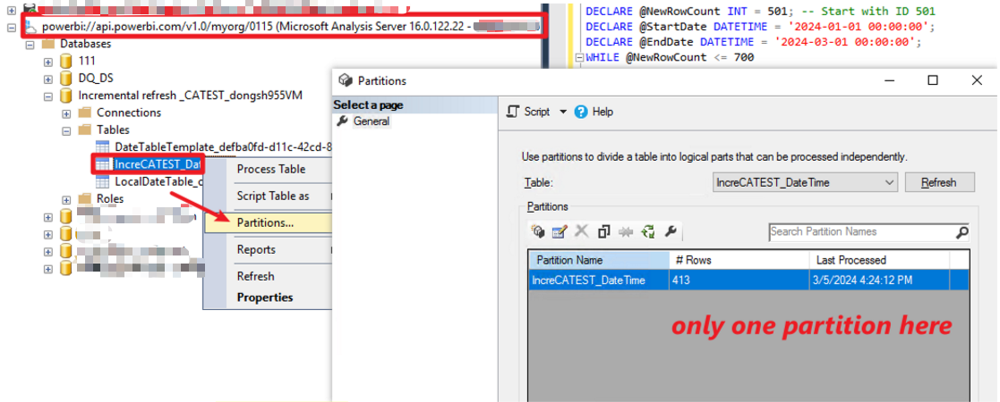
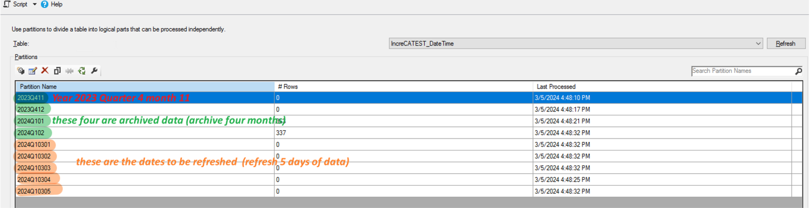
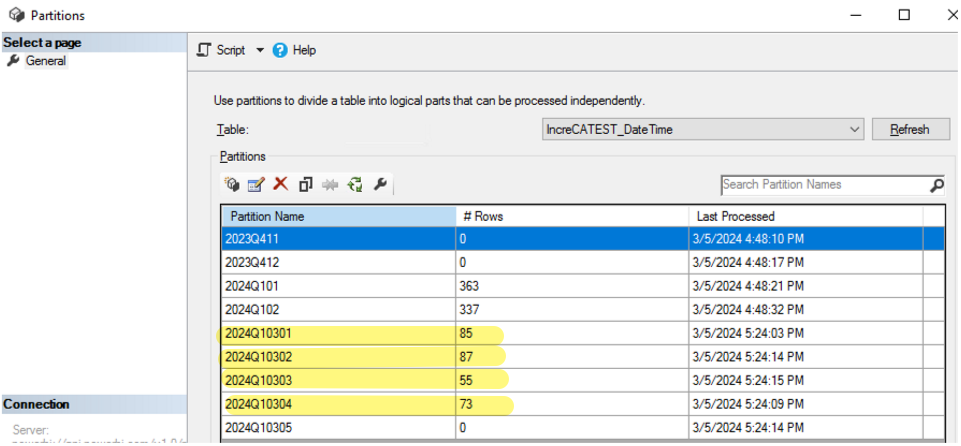

# Incremental Refresh Lab

## 1. Create a Test SQL Table

Create a table with a Date/Time column and random data. The following script generates 500 rows for testing incremental refresh:

```sql
CREATE TABLE IncreCATEST_DateTime (
    ID INT PRIMARY KEY IDENTITY(1,1),
    RandomDateTime DATETIME,
    RandomNumber FLOAT
);

DECLARE @StartDate DATETIME = '2024-01-01 00:00:00';
DECLARE @EndDate DATETIME = '2024-07-11 00:00:00';
DECLARE @RowCount INT = 1;

WHILE @RowCount <= 500
BEGIN
    INSERT INTO IncreCATEST_DateTime (RandomDateTime, RandomNumber)
    VALUES (DATEADD(SECOND, RAND() * DATEDIFF(SECOND, @StartDate, @EndDate), @StartDate), RAND());

    SET @RowCount = @RowCount + 1;
END
```

---

## 2. Configure Power BI Desktop

- Create `RangeStart` and `RangeEnd` parameters (both of type Date/Time).
- Apply these parameters to filter the Date/Time column in your data. After filtering, only 413 rows are included.



- Configure the incremental refresh policy, then publish the report to the Power BI Service.



---

## 3. Inspect Table via XMLA Endpoint Before First Refresh

Before performing the initial refresh in Power BI Service, inspect the table using the XMLA endpoint. Typically, you will see only a single partition at this stage.



---

## 4. Add Additional Rows to the Table

Add 200 more rows to the table using the following script:

```sql
SET IDENTITY_INSERT IncreCATEST_DateTime ON;
DECLARE @NewRowCount INT = 501; -- Start with ID 501
DECLARE @StartDate DATETIME = '2024-01-01 00:00:00';
DECLARE @EndDate DATETIME = '2024-03-01 00:00:00';
WHILE @NewRowCount <= 700
BEGIN
    INSERT INTO IncreCATEST_DateTime (ID, RandomDateTime, RandomNumber)
    VALUES (@NewRowCount,
            DATEADD(SECOND, RAND() * DATEDIFF(SECOND, @StartDate, @EndDate), @StartDate),
            RAND());

    SET @NewRowCount = @NewRowCount + 1;
END
```

---

## 5. Perform the Initial Refresh in Power BI Service

The first refresh in Power BI Service will be a full refresh. Subsequent refreshes will be incremental.  
After the initial refresh, the table contains 700 rows, and the `RangeStart` and `RangeEnd` parameters are managed by the incremental refresh policy.



---

## 6. Add More Rows and Perform an Incremental Refresh

Add 300 additional rows (with dates from 3/1 to 3/4) and perform a second refresh in Power BI Service. This refresh will be incremental, and you will observe that only the relevant partitions are refreshed.



---

## Notes

- After publishing the report to Power BI Service, `RangeStart` and `RangeEnd` are automatically managed by the service to query data according to the refresh period defined in the incremental refresh policy.  
  Refer to: [Incremental refresh for semantic models and real-time data in Power BI - Power BI | Microsoft Learn](https://learn.microsoft.com/en-us/power-bi/connect-data/incremental-refresh-overview)


