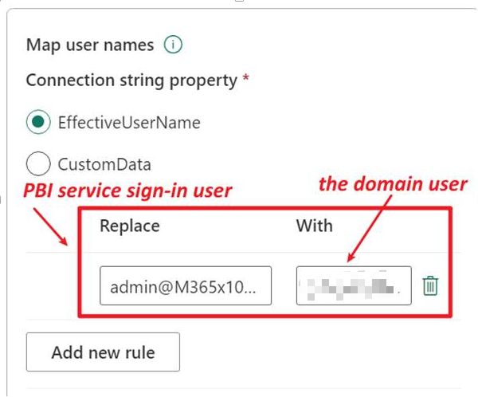
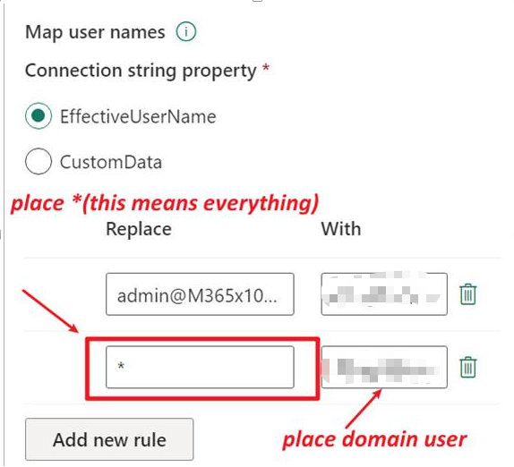

# Map User Name for Analysis Services (AS) Data Source

## Background

Refer to: [Manage SQL Server Analysis Services data sources - Power BI | Microsoft Learn](https://learn.microsoft.com/en-us/power-bi/connect-data/service-gateway-enterprise-manage-ssas)

When using a semantic model sourced from SQL Server Analysis Services (SSAS), each time a user interacts with a report connected to Analysis Services, the effective user name is passed to the gateway and then forwarded to your on-premises Analysis Services server. The email address used to sign in to Power BI is sent as the effective user in the `EffectiveUserName` connection property. This email address must match a defined user principal name (UPN) within the local Active Directory (AD) domain.

## Steps

1. After publishing the report sourced from SSAS to the Power BI service, you must configure the gateway connection and pay special attention to user mapping as described below.

### Single User Mapping

For a single user, you can set the mapping rule for the gateway connection as shown:

- **Replace:** Enter the Power BI service sign-in user.
- **With:** Enter the corresponding domain user.

### Multiple User Mapping

For multiple users, you can set a mapping rule using `*` to represent all users:

- **Replace:** Use `*` to represent all users.
- **With:** Enter the domain user to be used for all connections.

---

*Ensure that user mapping is correctly configured to allow seamless authentication and data access when connecting Power BI reports to on-premises Analysis Services via the gateway.*
