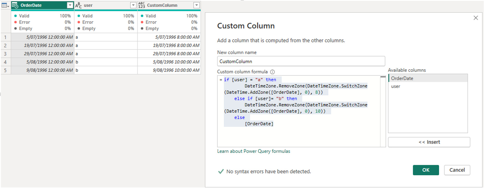

# Modifying Report Timezone in Power BI Service

By default, Power BI Service displays datetime values in UTC. To convert these values to a specific timezone, such as UTC+8, you can create a custom column in Power Query using the following formula:

```powerquery
= DateTimeZone.RemoveZone(DateTimeZone.SwitchZone(DateTime.AddZone([OrderDate], 0), 8))
```

---

If you need to apply different timezones for different rows (for example, set user "a" to UTC+8 and user "b" to UTC+10), use a conditional formula:

```powerquery
= if [user] = "a" then
    DateTimeZone.RemoveZone(DateTimeZone.SwitchZone(DateTime.AddZone([OrderDate], 0), 8))
  else if [user] = "b" then
    DateTimeZone.RemoveZone(DateTimeZone.SwitchZone(DateTime.AddZone([OrderDate], 0), 10))
  else
    [OrderDate]
```

---

The screenshot below demonstrates how to implement and configure these transformations in Power Query:


