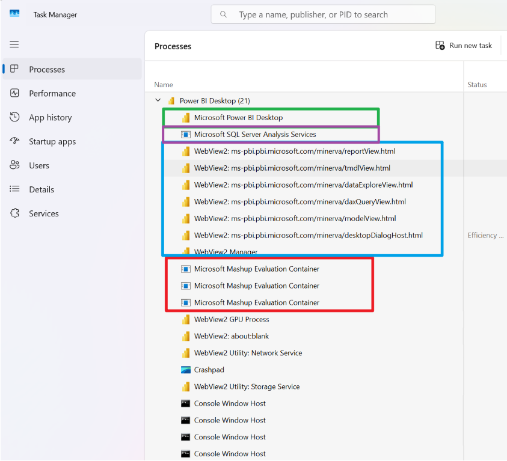

# Power BI Desktop Architecture

## Microsoft Power BI Desktop
This is the main application that kicks everything off. It’s responsible for launching and managing all the background components that make Power BI work.

## Microsoft SQL Server Analysis Services (SSAS)
This is a standard Analysis Services instance that holds the data model used in your Power BI report. You can connect to it using SSMS (SQL Server Management Studio) to inspect or interact with the model directly.  
For detailed steps, see [Using SSMS to Connect to Power BI Dataset](using-ssms-to-connect-dataset.md).

## Microsoft Mashup Evaluation Container
This component handles the data loading and transformation part. It fetches the data defined in Power Query and applies the necessary ETL (Extract, Transform, Load) steps to prepare it for analysis.

## Webview2
This is the modern replacement for the older CEFbrowser. It’s in charge of rendering visuals and generating semantic queries based on user interactions. These queries are then converted into DAX and sent to Analysis Services to retrieve the relevant data.

---

For example, Task Manager provides a consolidated view of all active subprocesses:

