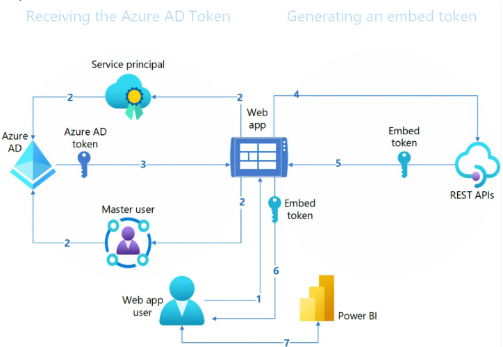
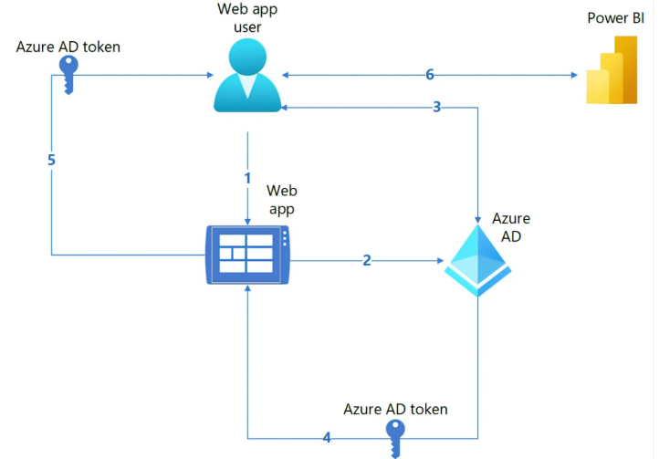

# Power BI Embedded Analytics: Solution Comparison

Refer to:  
[Power BI embedded analytics overview - Power BI | Microsoft Learn](https://learn.microsoft.com/en-us/power-bi/developer/embedded/embedded-analytics-power-bi)  
[Embed content in your Power BI embedded analytics application - Power BI | Microsoft Learn](https://learn.microsoft.com/en-us/power-bi/developer/embedded/embed-sample-for-customers?tabs=net-core)  
[Embed Content in Your Power BI Embedded Analytics Application for Your Organization - Power BI | Microsoft Learn](https://learn.microsoft.com/en-us/power-bi/developer/embedded/embed-sample-for-your-organization?tabs=net-core)

Power BI embedded analytics offers two main solutions: **Embed for your customers** and **Embed for your organization**.

- **Embed for your customers**: Build applications for external users using non-interactive authentication (service principal or master user). Users do not need to sign in with Power BI credentials.
- **Embed for your organization**: Build applications for internal users, requiring sign-in with Power BI credentials and supporting interactive authentication.

Below is a summary of the main differences between these two approaches:

| Feature                | Embed for your customer                                  | Embed for your organization                        |
|------------------------|---------------------------------------------------------|----------------------------------------------------|
| **User**               | External users                                          | Internal users                                     |
| **Authentication**     | Your own authentication                                 | Authentication to Azure AD                         |
| **Power BI License**   | No need to sign in with Power BI credentials            | Requires Power BI license                          |
| **Authentication Flow**| Non-interactive (Service Principal or Master User)      | Interactive                                        |
| **Data Ownership**     | App owns data                                           | User owns data                                     |
| **Target Audience**    | ISVs, third-party developers                            | Enterprises, large organizations                   |
| **Sign-in Location**   | Application                                             | Power BI                                           |
| **RLS (Row-Level Security)** | Configured in code and applied to the embed token; each user receives a different embed token | Configured in the service; user sign in to PBI service and RLS applied in service |

---

## Authentication Details for "Embed for your customer"

You can use either a **service principal** or a **master user** for authentication.  
You may also use [Power BI Playground](https://playground.powerbi.com/) to test embedding scenarios.

|                        | Service principal                                      | Master user                                         |
|------------------------|--------------------------------------------------------|-----------------------------------------------------|
| **Authentication**     | Non-interactive                                        | Non-interactive                                     |
| **User Sign-in**       | Users do not sign in to Azure AD or Power BI; the app uses a reserved Azure AD identity (service principal) to authenticate and generate the embed token | Users do not sign in to Azure AD or Power BI; the app uses a reserved Azure AD identity (master user) to authenticate and generate the embed token |
| **Prerequisites**      | - Enable settings in admin portal - Service principal must be a member or admin of the workspace - Capacity required for production due to embed token limits | - Master user must have a Power BI Pro or Premium Per User (PPU) license - Define delegated permissions (scopes) for the app - Capacity required for production due to embed token limits |

---

## Authentication Flow

Refer to: [Permission tokens needed to embed a Power BI app - Power BI | Microsoft Learn](https://learn.microsoft.com/en-us/power-bi/developer/embedded/embed-tokens?tabs=embed-for-customers)

### Embed for your customer

1. The web app user authenticates against your web app using your authentication method.
2. The web app uses a service principal or master user to authenticate against Azure AD.
3. The web app obtains an Azure AD token and uses it to access Power BI REST APIs, according to the authentication method.
4. The web app calls the Embed Token REST API to request an embed token, specifying which Power BI content can be embedded.
5. The REST API returns the embed token to your web app.
6. The web app passes the embed token to the user's browser.
7. The web app user uses the embed token to access Power BI content.

---

### Embed for your organization

1. The web app user accesses the web app.
2. The web app redirects the user to Azure AD.
3. The user authenticates against Azure AD using their Power BI credentials.
4. Azure AD redirects the user back to the web app with the Azure AD token (in an implicit grant scenario, the access token is returned to the user's browser).
5. The web app passes the Azure AD token to the user's browser.
6. The Power BI web app uses the Azure AD token to embed Power BI content (such as reports and dashboards) that the user has permission to access.

---

GitHub sample code can be found here: [Power BI Desktop samples](https://github.com/microsoft/PowerBI-Developer-Samples)
