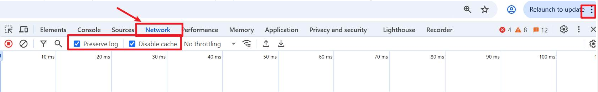
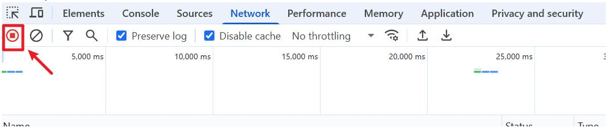
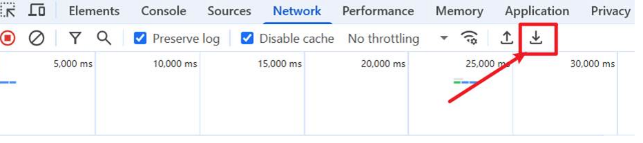
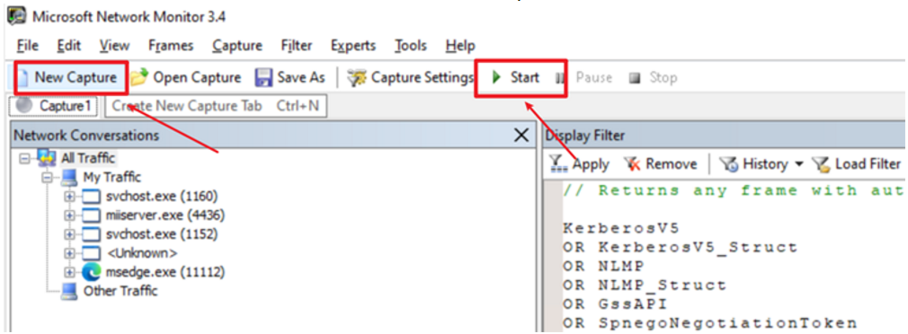
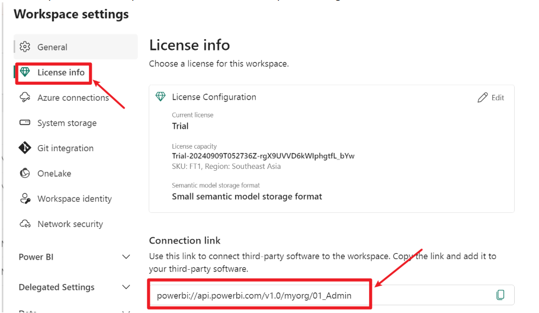
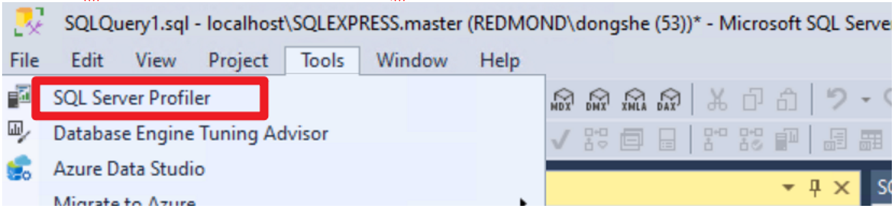
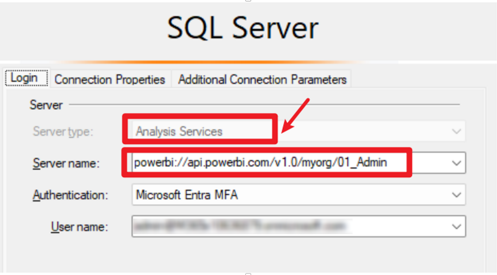
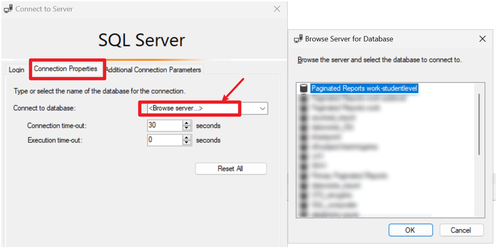
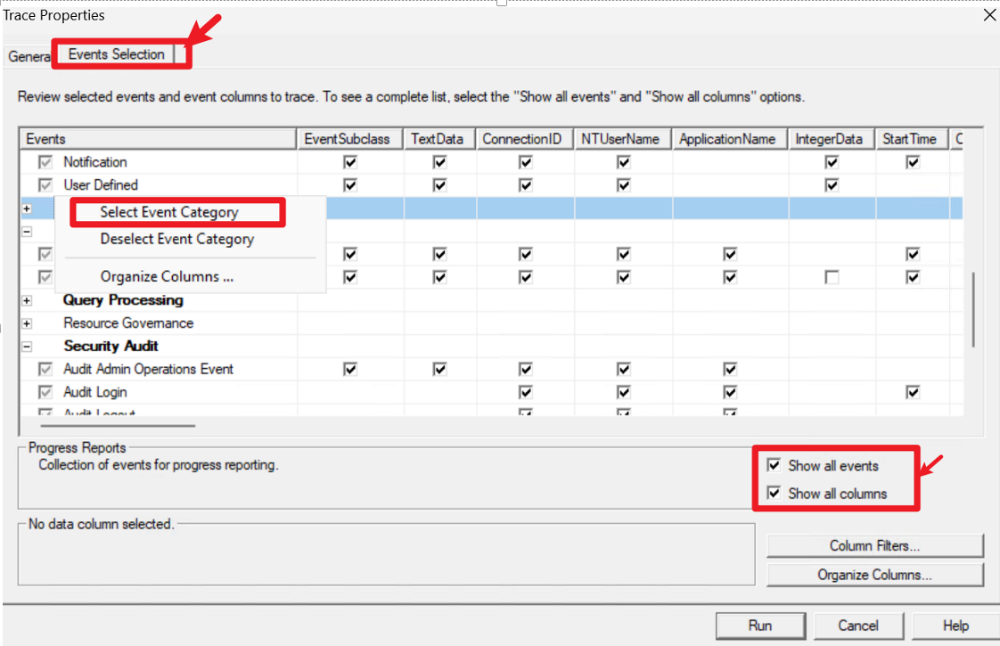
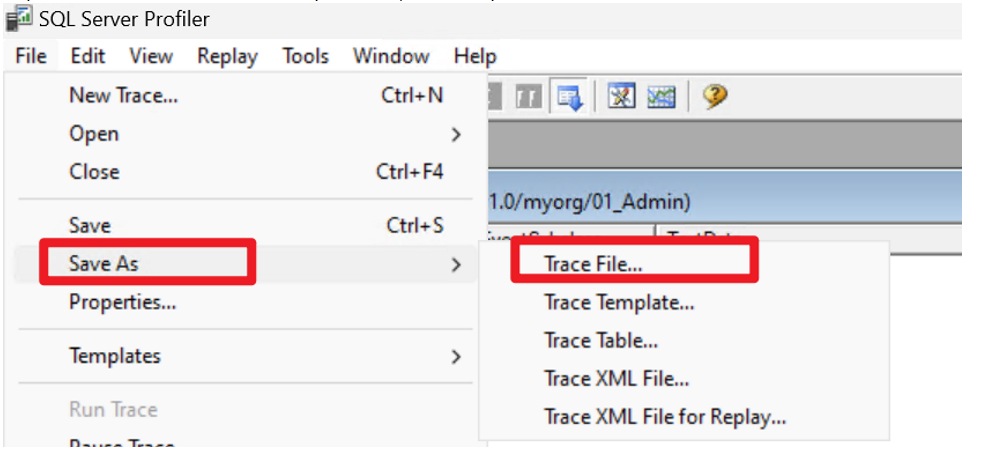

# Power BI Log Collection Guide

This guide provides step-by-step instructions for collecting various logs and traces to assist with troubleshooting issues in Power BI and Microsoft Fabric environments.

---

## HAR Network Trace

1. Open the Edge browser and navigate to the Fabric (Power BI) website.
2. Press **F12** to open Developer Tools or click the "..." menu, then select the **Network** tab.Check both **Preserve log** and **Disable cache** options.

   

4. Reproduce the issue.
5. Click the **Stop** button to end the capture.  

   

6. Click the **Download** button to export the HAR trace.  

   

## Power BI Desktop Trace

refer to: [Power BI Desktop diagnostics collection - Power BI | Microsoft Learn](https://learn.microsoft.com/en-us/power-bi/fundamentals/desktop-diagnostics)

Steps:
1. Set the `PBI_forceTracing` environment variable to `1` (search for "Edit environment variables for your account" and add a new user variable).
2. In Power BI Desktop, go to **File** > **Options and settings** > **Options** > **Diagnostics**.
3. Check **Enable tracing** and click OK.
4. Reproduce the issue in Power BI Desktop.
5. Return to **Diagnostics** and click **Collect diagnostic information**.
6. Close Power BI Desktop.
7. Open `%localappdata%\Microsoft\Power BI Desktop\Traces` (or `%userprofile%\Microsoft\Power BI Desktop Store App\Traces` for the Store version) and compress the contents into a ZIP file.

**Executable locations:**
- Store version:  
  `C:\Program Files\WindowsApps\Microsoft.MicrosoftPowerBIDesktop_XXXXXXX\bin\PBIDesktop.exe`
- Web version:  
  `C:\Program Files\Microsoft Power BI Desktop\bin\PBIDesktop.exe`

## Netmon Trace

1. Download and install [Microsoft Network Monitor](https://www.microsoft.com/en-us/download/details.aspx?id=4865).
2. Run Netmon as administrator, click **New Capture**, and then **Start**. 

   

3. Reproduce the issue.
4. Save the recorded session as a `.cap` file.

## Procmon Trace

1. Download [Process Monitor - Windows Sysinternals | Microsoft Learn](https://learn.microsoft.com/en-us/sysinternals/downloads/procmon).
2. Open Procmon and go to **File > Capture Events**.
3. Reproduce the issue.
4. Stop the capture and select **Save**.

## SQL Server Profiler: Capture Premium Workspace Semantic Model Trace

1. Find the premium workspace connection URL: Go to **Workspace settings > License info > Connection link**.

   

2. Open SSMS (SQL Server Management Studio), go to **Tools > SQL Server Profiler**, and connect to Analysis Services using the workspace connection link as the server name.

   

   

3. Browse to the detailed semantic model.

   

4. For event selection, check **Select all events** and **Select all columns**.  
   For event categories such as **Progress reports**, **Queries events**, and **Query processing**, right-click on the category and choose **Select event category**. Then click **Run**.

   

5. Reproduce the issue. After reproducing, save the profiler trace as a trace file.

   

---

*Collecting these logs and traces will help diagnose and resolve issues more efficiently in Power BI and Microsoft Fabric environments.*
