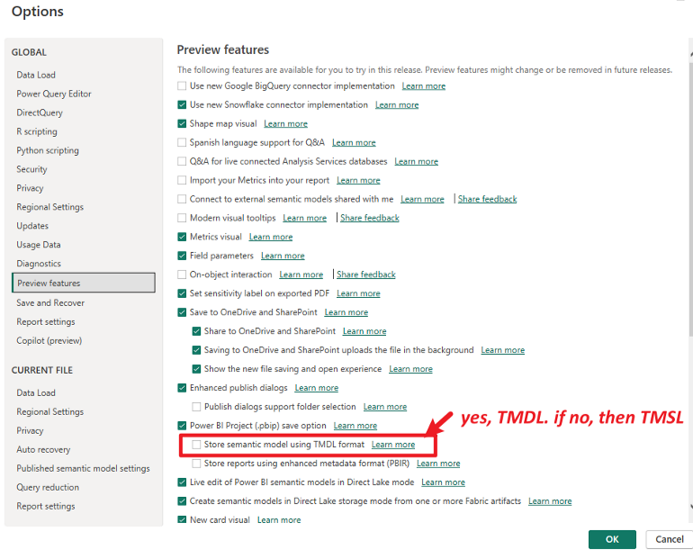
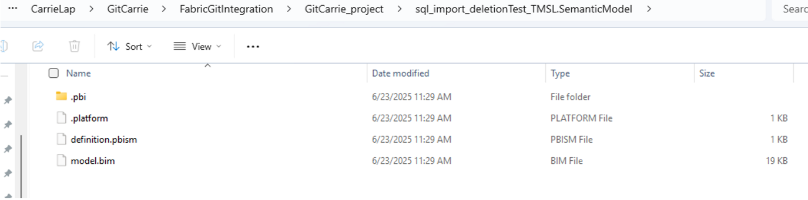
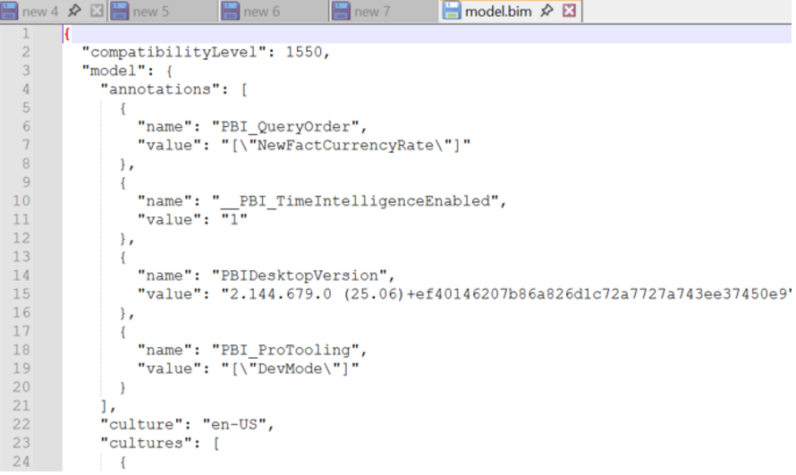
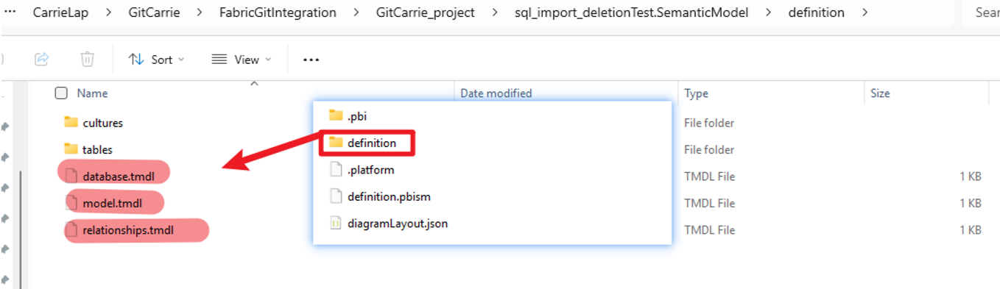
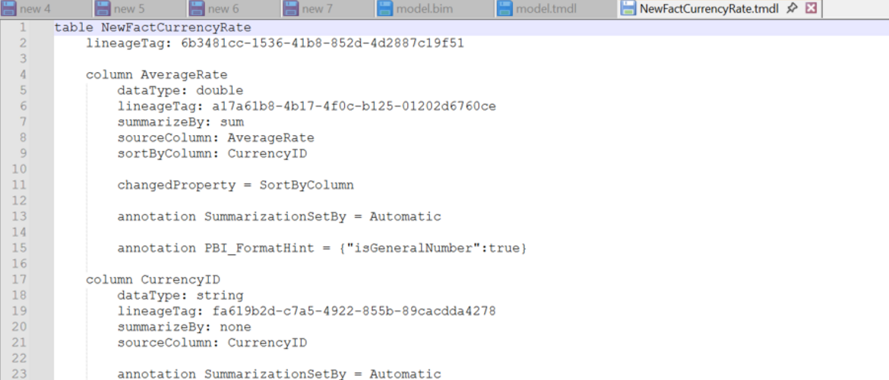

# TMSL vs TMDL vs TOM

## References

- [Tabular Model Definition Language (TMDL) | Microsoft Learn](https://learn.microsoft.com/en-us/analysis-services/tmdl/tmdl-overview?view=sql-analysis-services-2025&source=recommendations)
- [Tabular Model Scripting Language (TMSL) Reference | Microsoft Learn](https://learn.microsoft.com/en-us/analysis-services/tmsl/tabular-model-scripting-language-tmsl-reference?view=sql-analysis-services-2025)
- [Tabular Object Model (TOM) | Microsoft Learn](https://learn.microsoft.com/en-us/analysis-services/tom/introduction-to-the-tabular-object-model-tom-in-analysis-services-amo?view=sql-analysis-services-2025)

---

## Overview

**Tabular Model Scripting Language (TMSL)**  
TMSL is the command and object model definition syntax for tabular data models at **compatibility level 1200 or higher**. TMSL communicates with Analysis Services through the XMLA protocol, where the XMLA.Execute method accepts both JSON-based statement scripts in TMSL as well as traditional XML-based scripts in Analysis Services Scripting Language (ASSL for XMLA). Object definitions are structured as JSON instead of XML and are saved in the `model.bim` file.

**Tabular Model Definition Language (TMDL)**  
TMDL is an object model definition syntax for tabular data models at **compatibility level 1200 or higher**. Unlike TMSL, TMDL implements a **folder structure**. The default folder structure has only one level of sub-folders, each containing `.tmd` files for cultures, perspectives, roles, tables, etc. Root files include expressions, model, relationships, and datasources. Users can leverage the **TMDL view** in Power BI Desktop to work with TMDL.

**Tabular Object Model (TOM)**  
TOM is an extension of the Analysis Management Object (AMO) client library, created to support programming scenarios for tabular models at **compatibility level 1200 and higher**. It is a .NET API that developers use to **programmatically** manage tabular models in Power BI or Analysis Services.

## Model Storage in Power BI Desktop

In Power BI Desktop, you can store the model in either TMSL or TMDL format. Refer to: [Power BI Desktop project semantic model folder - Power BI | Microsoft Learn](https://learn.microsoft.com/en-us/power-bi/developer/projects/projects-dataset#tmdl-format) 

**TMSL Example**  
- Model is stored as a single `model.bim` file in JSON format.
  
  

**TMDL Example**  
- Model is stored in a folder structure.  
- In the `tables` folder, each table is represented by a `.tmdl` file, such as `newfactcurrencyrate.tmdl`.
  
  

---

