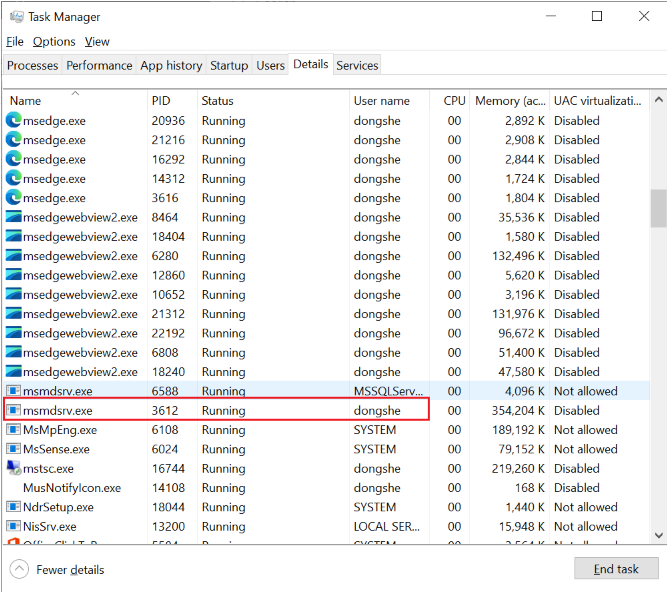
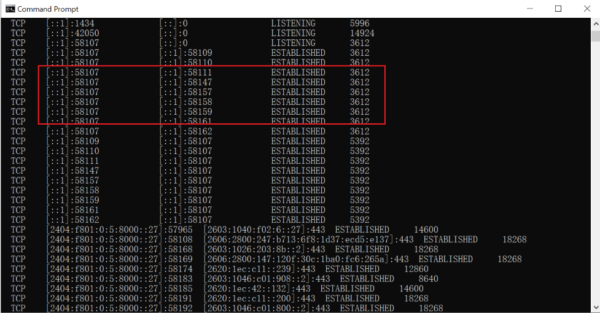
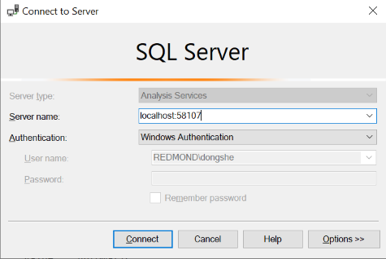
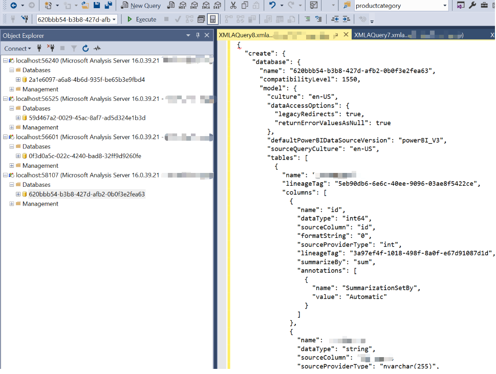

# Using SSMS to Connect to Power BI Dataset

**Refer:**  
[Monitor report performance in Power BI - Power BI | Microsoft Learn](https://learn.microsoft.com/en-us/power-bi/guidance/monitor-report-performance)

---

## Steps

1. **Open a pbix file in Power BI Desktop.**
2. **Check the Task Manager for the PID of `msmdsrv.exe`.**

   

3. **Open Command Prompt, input `netstat -ano`, and find the corresponding port number to the PID above.**  
   You can use the following command to filter the data matched to a specific PID (e.g., 3612):

   ```
   netstat -ano | findstr "3612"
   ```

   

4. **In SSMS, choose Analysis Services.**

   

5. **Right-click the dataset ID, choose `Script > Script Database as > Create To > New Query Editor Window`.**

   

---

*Follow these steps to connect to a Power BI dataset using SQL Server Management Studio (SSMS) for advanced analysis and scripting.*
