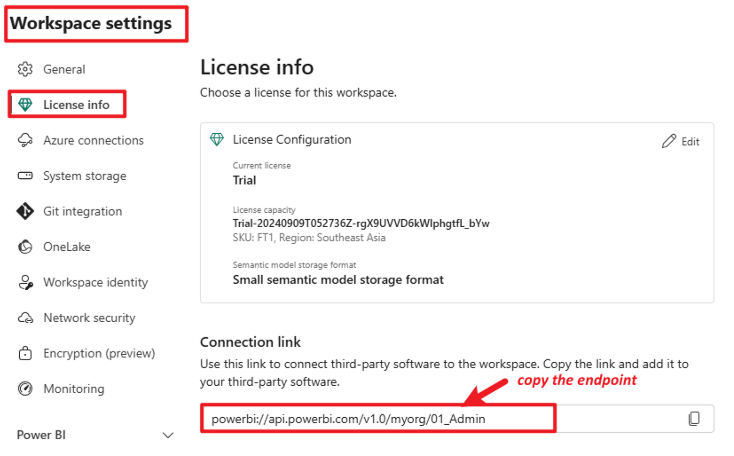
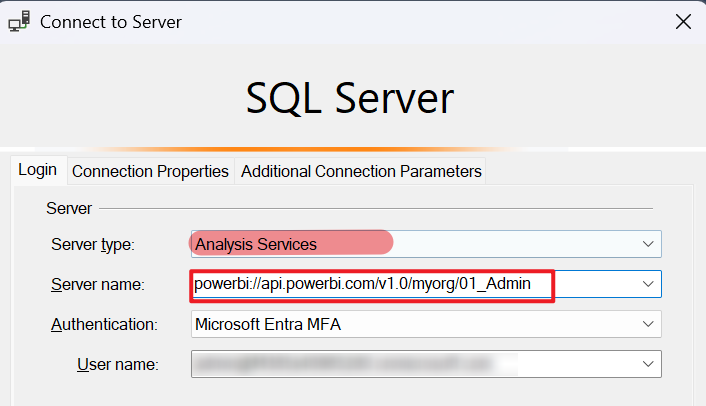

# Use SSMS to Connect to Power BI Premium Workspace

Refer to: [Semantic model connectivity and management with the XMLA endpoint in Power BI - Power BI | Microsoft Learn](https://learn.microsoft.com/en-us/power-bi/enterprise/service-premium-connect-tools)

---

## Overview

Power BI Premium, Premium Per User, and Power BI Embedded workspaces use an XMLA endpoint to support open-platform connectivity from Microsoft and third-party client applications and tools.

---

## Steps to Connect Using SSMS

1. **Get the Premium Workspace XMLA Endpoint**

   - In the Power BI Service, navigate to the workspace settings and locate the XMLA endpoint under the "License info" section.

     

2. **Open SSMS and Connect**

   - Open SQL Server Management Studio (SSMS).
   - Choose server type as **Analysis Services**.
   - Paste the XMLA endpoint as the server name.
   - Use your Azure Active Directory (AAD) account for authentication.

     

3. **Guest/External User Access**

   - If a guest or external user needs to connect to the home tenant premium workspace via XMLA endpoint, ensure the user has been granted workspace permission.
   - The endpoint format should be:

     ```
     powerbi://api.powerbi.com/v1.0/HomeTenantDomain/01_Admin
     ```

     For example:

     ```
     powerbi://api.powerbi.com/v1.0/contoso.com/01_Admin
     ```

---

*By following these steps, you can connect to a Power BI Premium workspace using SSMS for advanced management and analysis tasks.*
