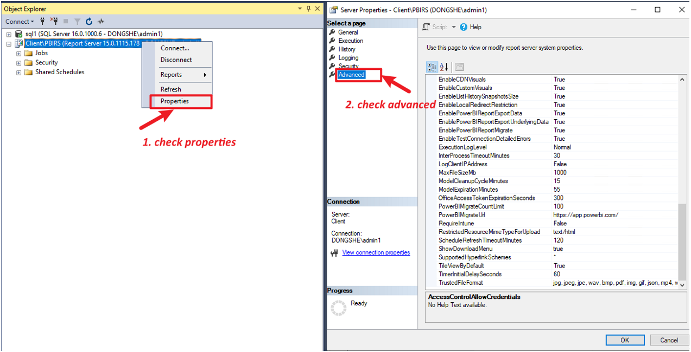

# Checking Report Server Advanced Properties

To review and modify advanced properties for the Report Server, follow these steps:

## Reference Documentation

- [Server properties Advanced page - SQL Server Reporting Services (SSRS) | Microsoft Learn](https://learn.microsoft.com/en-us/sql/reporting-services/tools/server-properties-advanced-page-reporting-services?view=sql-server-ver17)
- [Connect to a Report Server in Management Studio - SQL Server Reporting Services (SSRS) | Microsoft Learn](https://learn.microsoft.com/en-us/sql/reporting-services/tools/connect-to-a-report-server-in-management-studio?view=sql-server-ver16)

## Step-by-Step Instructions

1. **Connect to the Reporting Services instance**  
   open SSMS (SQL server management studio) and connect to the Reporting Services instance.

   
   

2. **Review Server Properties**  
   Right-click the connected server and select "Properties", and navigate to the "Advanced" page to view and adjust advanced settings.

   

  **Note:** Changes will apply to all servers in a scale-out deployment, as these settings are stored centrally in the Catalog database.

## Direct Database Modification

- Advanced settings are stored in the `[ClientReportServer].[dbo].[ConfigurationInfo]` table within the Catalog database.
- You may also update settings directly in this table if necessary.

   
