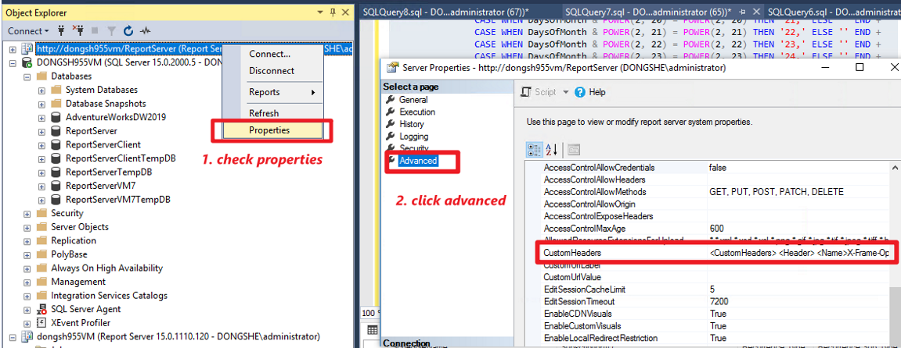

# Configuring HSTS or SecureConnectionLevel for PBIRS

To enhance connection security in Power BI Report Server (PBIRS), you can either configure the HTTP Strict Transport Security (HSTS) custom header or set the SecureConnectionLevel property.

## Option 1: Configure HSTS via Custom Header

You can configure HSTS by modifying the custom header in the server's advanced properties. refer to: [Server properties Advanced page - SQL Server Reporting Services (SSRS) | Microsoft Learn](https://learn.microsoft.com/en-us/sql/reporting-services/tools/server-properties-advanced-page-reporting-services?view=sql-server-ver17)

### Steps

1. **Open SSMS and Connect to PBIRS**  
   Access the server advanced properties. For details, refer to [PBIRS-check-advanced-properties.md](PBIRS-check-advanced-properties.md).

   

2. **Modify Custom Headers**  
   By default, the custom headers section may look like:

   ```xml
   <CustomHeaders>
     <Header>
       <Name>X-Frame-Options</Name>
       <Pattern>(?(?=.*api.*|.*rs:embed=true.*|.*rc:toolbar=false.*)...)</Pattern>
       <Value>SAMEORIGIN</Value>
     </Header>
     <Header>
       <Name>X-Content-Type-Options</Name>
       <Pattern>.*((\.js$)|(\.css$)|(\.html$))</Pattern>
       <Value>nosniff</Value>
     </Header>
   </CustomHeaders>
   ```

   To enable HSTS, replace with:

   ```xml
   <CustomHeaders>
     <Header>
       <Name>X-Frame-Options</Name>
       <Pattern>(?(?=.*api.*|.*rs:embed=true.*|.*rc:toolbar=false.*)...)</Pattern>
       <Value>SAMEORIGIN</Value>
     </Header>
     <Header>
       <Name>X-Content-Type-Options</Name>
       <Pattern>.*((\.js$)|(\.css$)|(\.html$))</Pattern>
       <Value>nosniff</Value>
     </Header>
     <Header>
       <Name>Strict-Transport-Security</Name>
       <Pattern>(.*)</Pattern>
       <Value>max-age=86400; includeSubDomains=true</Value>
     </Header>
   </CustomHeaders>
   ```

   - `max-age` specifies the time (in seconds) browsers should only use HTTPS.
   - For more details, see [RFC 2616](https://www.rfc-editor.org/rfc/rfc2616).

3. **Restart PBIRS**  
   Changes will sync across scale-out deployments, but verify on all instances.

### Alternative: Update via SQL

You can also update the custom header directly in the `[dbo].[ConfigurationInfo]` table:

```sql
UPDATE [PBIRSReportServer].[dbo].[ConfigurationInfo]
SET Value = '<CustomHeaders> ... <Header> <Name>Strict-Transport-Security</Name> <Pattern>(.*)</Pattern> <Value>max-age=86400; includeSubDomains=true</Value> </Header> ... </CustomHeaders>'
WHERE ConfigInfoID = '063E94CC-EB72-49F5-B667-C6DA01683EA6';
```

---

## Option 2: Set SecureConnectionLevel

Alternatively, set the `SecureConnectionLevel` property to `1` to enforce secure connections.

- If only `SecureConnectionLevel` is set to `1` without proper configuration, PBIRS may fail to manage or open reports.

  

- Ensure the `ReportServerUrl` section in `rsreportserver.config` is set to your HTTPS web service URL:

  ```xml
  <ReportServerUrl>https://clientcarrie.dongshe.lab/ReportServer</ReportServerUrl>
  ```

---

