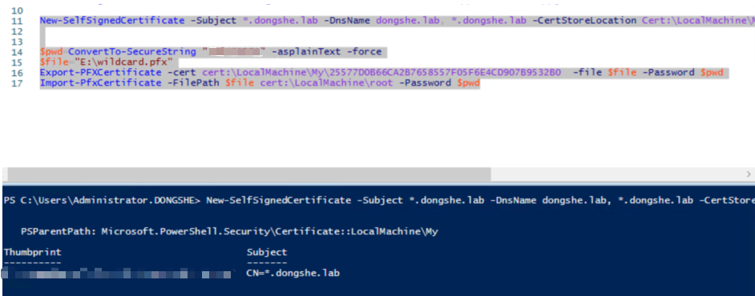
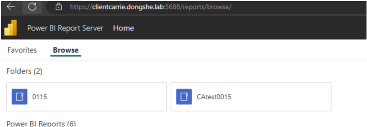
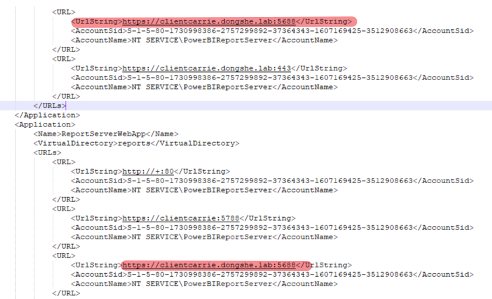
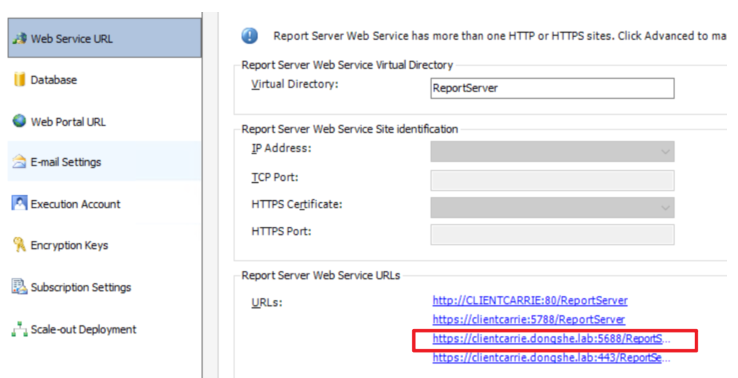

# Configuring PBIRS SSL URLs with a Wildcard Certificate

This guide outlines the steps to configure Power BI Report Server (PBIRS) to use SSL URLs based on a wildcard certificate.

## 1. Generate a Self-Signed Wildcard Certificate

for testing purpose, we could use PowerShell to create a wildcard certificate for your domain, and then install the certifact into the certificate root store also the personal store:

```powershell
New-SelfSignedCertificate -Subject *.dongshe.lab -DnsName dongshe.lab, *.dongshe.lab -CertStoreLocation Cert:\LocalMachine\My -NotAfter (Get-Date).AddYears(10)
$pwd = ConvertTo-SecureString "XXXXX" -AsPlainText -Force
$file = "E:\wildcard.pfx"
Export-PFXCertificate -cert cert:\LocalMachine\My\<THUMBPRINT_FROM_FIRST_STEP> -File $file -Password $pwd
Import-PfxCertificate -FilePath $file cert:\LocalMachine\root -Password $pwd
```



## 2. Configure PBIRS to Use the Wildcard Certificate

In PBIRS Configuration Manager, the wildcard certificate will be reflected in the URL configuration as:

- `https://+:<port>/reports`
- `https://+:<port>/ReportServer`

To access PBIRS in a browser, use the FQDN and port, for example:  
`https://clientcarrie.dongshe.lab:5688/reports`



## 3. Replace the Default URL with FQDN-Based URL

To replace the default `https://+...` URLs with URLs containing your FQDN, use the following `netsh` commands:

```cmd
netsh http delete urlacl https://+:5688/reports/
netsh http delete urlacl https://+:5688/ReportServer/
netsh http delete urlacl https://+:5688/wopi/
netsh http delete urlacl https://+:5688/PowerBI/

netsh http add urlacl url="https://clientcarrie.dongshe.lab:5688/ReportServer" user="NT SERVICE\PowerBIReportServer"
netsh http add urlacl url="https://clientcarrie.dongshe.lab:5688/Reports" user="NT SERVICE\PowerBIReportServer"
netsh http add urlacl url="https://clientcarrie.dongshe.lab:5688/PowerBI" user="NT SERVICE\PowerBIReportServer"
netsh http add urlacl url="https://clientcarrie.dongshe.lab:5688/wopi" user="NT SERVICE\PowerBIReportServer"
```

Update the `rsreportserver.config` file to reflect the new FQDN-based URLs.



## 4. Validate Configuration

After restarting PBIRS, the new FQDN-based URLs will be visible in the PBIRS Configuration Manager.


