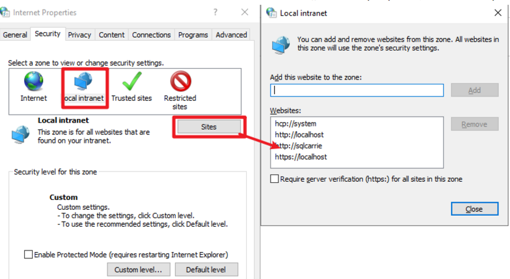
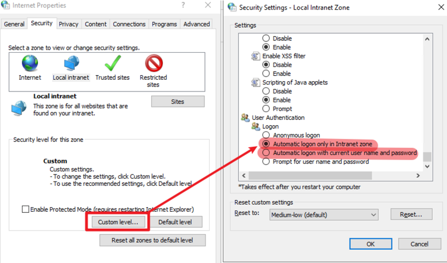
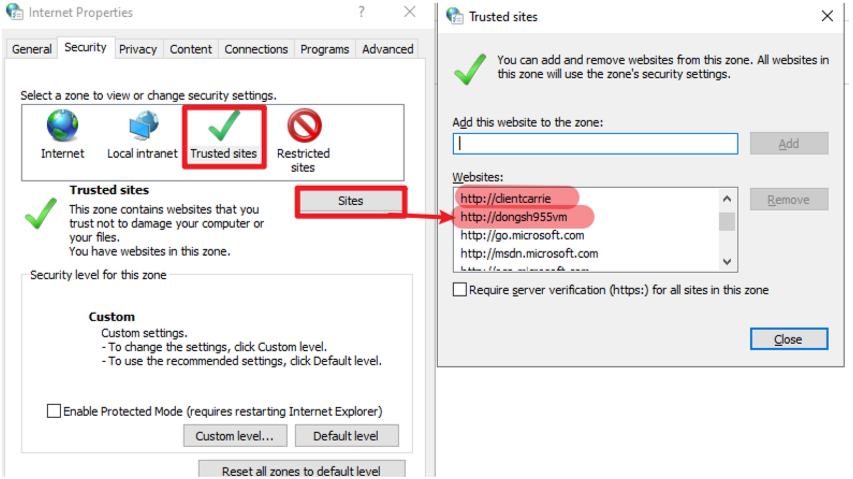
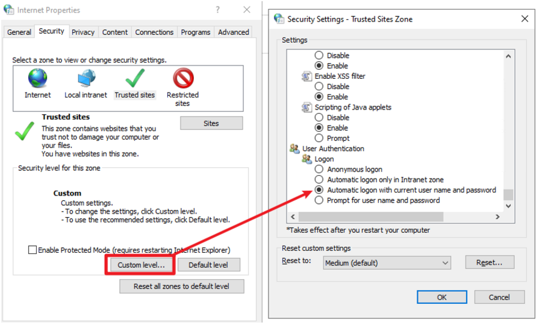

# Configure Auto Logon for PBIRS

This guide describes how to configure automatic logon for Power BI Report Server (PBIRS) in user client environments, ensuring seamless authentication for users accessing PBIRS resources.

---

## Steps for Configuration

### 1. Add PBIRS Sites to Local Intranet

- On the client machine (not the PBIRS server), press `Win + R`, enter `inetcpl.cpl`, and open **Internet Options**.
- Go to the **Security** tab, select **Local intranet**, and click **Sites**.
- Add your PBIRS URLs to the local intranet zone.

- Click **Custom level...** and set the authentication option to either:
  - "Automatic logon only in Intranet zone"
  - "Automatic logon with current user"

### 2. Add PBIRS Sites to Trusted Sites

- In **Internet Options**, go to the **Security** tab and select **Trusted sites**.
- Add your PBIRS URLs to the trusted sites zone.

- Click **Custom level...** and set the authentication option to "Automatic logon".

---

By configuring these settings, users will be able to access PBIRS without repeated authentication prompts, improving usability and reducing friction for report access.
