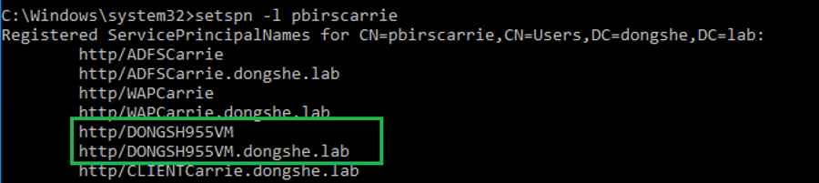
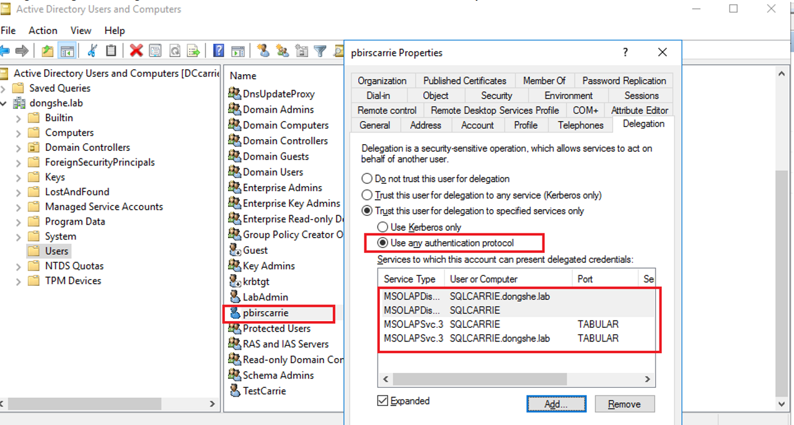

# Kerberos Configuration for PBIRS

## Overview

Kerberos delegation enables an application or service to access resources hosted on another server on behalf of a user. This is essential for scenarios where PBIRS must retrieve data from backend sources, such as SQL Server or Analysis Services, using the identity of the client user.

A **Service Principal Name (SPN)** is a unique identifier for a service instance. Kerberos authentication uses SPNs to associate a service instance with a service logon account, allowing client applications to request service authentication without knowing the account name.

**Delegation Workflow Example:**  
Client → PBIRS Service Account → SQL Server (Data Source)  
Users access PBIRS from their client machines, and PBIRS retrieves data from SQL Server hosted elsewhere. Delegation is configured for the PBIRS service account, not the client user, enabling Kerberos authentication to the backend data source using the client user's identity.

---

## Configuration Steps

Refer to: [Configure Kerberos to use Power BI reports - Power BI | Microsoft Learn](https://learn.microsoft.com/en-us/sql/reporting-services/tools/connect-to-a-report-server-in-management-studio?view=sql-server-ver16)

### 1. Kerberos Constrained Delegation Configuration

- **Change authentication Type in Report Server Config**
- **Set SPNs for Report Server Service Account**
- **Set SPNs for Data Sources (e.g., SSAS)**
- **Configure Delegation from RS to Data Source** : Add SPNs of the data source to the report server service account.

### 2. Detailed Steps

#### a. Change authentication Type in `rsreportserver.config`

Modify the authentication type to support Kerberos constrained delegation.

**Before:**
```xml
<AuthenticationTypes>
  <RSWindowsNTLM/>
</AuthenticationTypes>
```

**After:**
```xml
<AuthenticationTypes>
  <RSWindowsNegotiate/>
  <RSWindowsNTLM/>
</AuthenticationTypes>
```

#### b. Set SPNs for PBIRS Service Account

- For virtual service accounts or network service, SPNs are generated by default.
- For domain user accounts, register SPNs manually:

```cmd
setspn -S http/servername domain\SSRSSvcAccount         // NetBIOS
setspn -S http/servername.domain.com domain\SSRSSvcAccount // FQDN
```

such as in my local environment:
```cmd
setspn -s http/DONGSH955VM.dongshe.lab pbirscarrie
setspn -s http/DONGSH955VM pbirscarrie
```




#### c. Set SPNs for data source, such as for SSAS.

Refer to: [SPN registration for an Analysis Services instance | Microsoft Learn](https://learn.microsoft.com/en-us/analysis-services/instances/spn-registration-for-an-analysis-services-instance?view=asallproducts-allversions)

Register SPNs for SSAS and SQL Server Browser:

```cmd
setspn -s MSOLAPSvc.3/SQLCarrie.dongshe.lab:Tabular SQLCarrie
setspn -s MSOLAPSvc.3/SQLCarrie:Tabular SQLCarrie
setspn -s MSOLAPDisco.3//SQLCarrie.dongshe.lab SQLCarrie
setspn -s MSOLAPDisco.3//SQLCarrie SQLCarrie
```

#### d. Configure Delegation Settings on the RS Service Account

- In Active Directory, edit the PBIRS service account properties.
- Enable "Use Kerberos only" for delegation.
- Add the SPNs for the Analysis Services service to delegate PBIRS service account to Data source.



---

By following these steps, you can ensure secure Kerberos delegation for PBIRS, enabling seamless authentication and data access across services.
