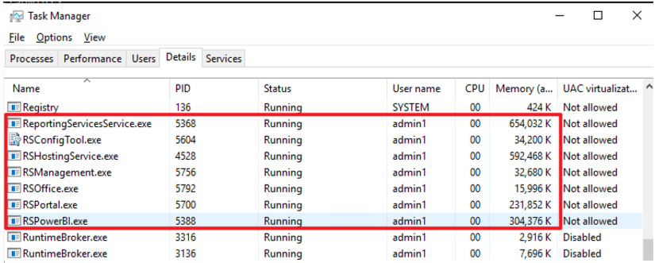
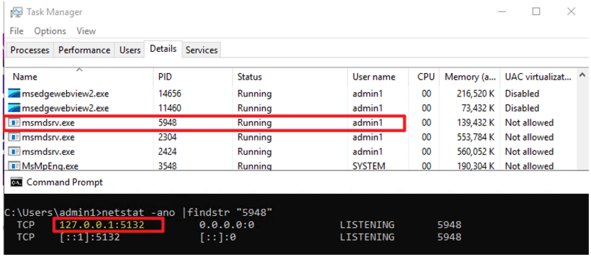

# Power BI Report Server (PBIRS) Component Overview

## Main Components

- **RSHostingService.exe**  
  Parent process for all components, responsible for launching and managing other PBIRS services.

- **RSManagement.exe**  
  Management utility responsible for handling configuration settings and administrative tasks.

- **RSPortal.exe**  
  Manages the web portal of the report server. Enables users to view and manage reports and KPIs through a web browser. Also handles REST API interactions.

- **RSPowerBI.exe**  
  Handles components related to Power BI (.pbix) reports, including data refresh operations, connection testing, and Power BI Web API interactions.

- **ReportingServicesService.exe**  
  Manages paginated reports (.rdl), including report processing and SOAP endpoint services.

- **RSOffice.exe**  
  Responsible for Excel-related functionalities.

- **Msmdsrv.exe**  
  Represents the SQL Server Analysis Services (SSAS) process. Loads and processes the data models used in Power BI reports. By default, it runs on `localhost:5132`.

---

## Identifying Subprocesses in Task Manager

Each subprocess can be identified in Task Manager as shown below:

