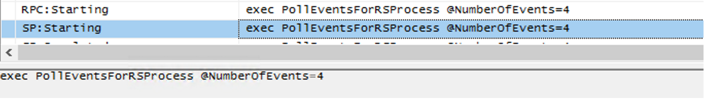
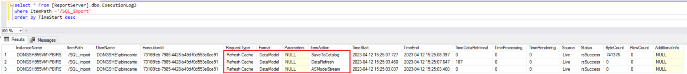
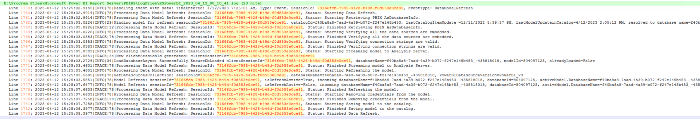

# PBIRS Data Model Refresh Logic

## Overview

When a scheduled refresh plan is created in RSPortal, it will create a schedule similar to subscription of paginated report. This results in a SQL Agent job named after the Schedule ID. At the scheduled time, PBIRS inserts a record into Catalog event table, also known as event queue.

PBIRS regularly polls the event table to pick up refresh events. By default, polling occurs every 10 seconds, configurable via the `PollingIntervalSeconds` setting. Each polling cycle will go to pick the events from Event table, which will then be immediately removed from the queue. During polling, PBIRS checks if the number of active data refresh tasks exceeds `MaxQueueThreads`. If so, it pauses event retrieval until the task count drops. `MaxQueueThreads` is set in `rsreportserver.config` (default is 0, meaning no direct limit). The actual concurrency depends on system resources. The number of events processed per polling cycle is determined by machine capability and can be monitored using SQL Profiler against the PBIRS catalog database.



## Log Overview

### 1. Execution Log

The execution log records three main phases for each refresh operation, all sharing the same execution ID:

- **ASModelStream:** The data model is streamed from the catalog to Analysis Services.
- **DataRefresh:** Data is refreshed from one or more sources.
- **SaveToCatalog:** The refreshed data model is saved back to the catalog.

Example query:
```sql
SELECT * FROM [ReportServer].dbo.ExecutionLog3
WHERE ItemPath = '/SQL_import'
ORDER BY TimeStart DESC
```



### 2. RS Verbose Log

The session ID in RS log files corresponds to the execution ID. The log details each phase and event during the refresh process.



**Note:** PBIRS does not immediately delete databases from the Analysis Services engine after refresh or report viewing. Instead, expired embedded models are cleaned up periodically, based on `ModelCleanupCycleMinutes` (default: 15 minutes). Expiration is determined by comparing the last used timestamp against `ModelExpirationMinutes` (default: 60 minutes).


## Settings Overview

- **PollingIntervalSeconds:** Defined in `rsreportserver.config` (`C:\Program Files\Microsoft Power BI Report Server\PBIRS\ReportServer`)
- **MaxQueueThreads:** Defined in `rsreportserver.config`
- **ModelCleanupCycleMinutes:** Defined in server advanced properties (see [PBIRS-check-advanced-properties.md](PBIRS-check-advanced-properties.md))
- **ModelExpirationMinutes:** Defined in server advanced properties

## References

- [RsReportServer.config configuration file - SQL Server Reporting Services (SSRS) | Microsoft Learn](https://learn.microsoft.com/en-us/sql/reporting-services/report-server/rsreportserver-config-configuration-file?view=sql-server-ver17)
- [Server properties Advanced page - SQL Server Reporting Services (SSRS) | Microsoft Learn](https://learn.microsoft.com/en-us/sql/reporting-services/tools/server-properties-advanced-page-reporting-services?view=sql-server-ver17)
