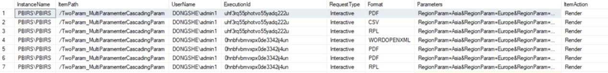

# PBIRS Download, Export, Upload, and Delete File Log Reference

This document provides real log examples for key file operations in Power BI Report Server (PBIRS), including downloading, exporting, uploading, and deleting PBIX and paginated (RDL) reports. These log entries are useful for auditing and troubleshooting user actions.

---

## For Paginated Report

### 1. Render/Export as PDF, PPT, etc. (no log in browser trace), we could trace such event more easily via execution log.

**Execution log:**  
In SSMS, against the ReportServerDB, run the following query:
```sql
select * From dbo.ExecutionLog3   
order by TimeStart desc
```


### 2. Download RDL File

**RSPortal**

In the log files, you can find keywords such as **GET** and **CatalogItems** indicating the HTTP method and the API endpoint being accessed.

```
2025-04-11 08:00:15.4747|INFO|126|Received request GET /api/v2.0/catalogitems(62f536dd-95e6-4c9b-beb3-97436c23aab5)/Content/$value| RequestID = s_fe98d8a3-aae6-4caf-b51d-b2d220d20fb2 
2025-04-11 08:00:15.5164|INFO|128|Sending response. Response code DONGSHE\admin1 200, Elapsed time 0:00:00.0417449| RequestID = s_fe98d8a3-aae6-4caf-b51d-b2d220d20fb2 
```

### 3. Upload a RDL File (no report name, neither catalogitem)

**RSPortal**

In the log files, you can find keywords such as **POST**, **CatalogItems** and **Report created**.

```
2025-05-16 12:56:07.3076|INFO|168|Received request POST /api/v2.0/catalogitems| RequestID = s_f354260e-5d23-43ef-9eff-2ce50f1b5f14 
2025-05-16 12:56:50.4927|INFO|168|Report created| RequestID = s_f354260e-5d23-43ef-9eff-2ce50f1b5f14 
2025-05-16 12:56:50.4927|TRACE|168|Created| RequestID = s_f354260e-5d23-43ef-9eff-2ce50f1b5f14 
2025-05-16 12:56:50.4957|INFO|77|Sending response. Response code DONGSHE\admin1 201, Elapsed time 0:00:43.1890095| RequestID = s_f354260e-5d23-43ef-9eff-2ce50f1b5f14 
```

### 4. Delete a RDL File

**RSPortal**

In the log files, you can find keywords such as **DELETE**, **CatalogItems** and **Item deleted**.

```
2025-05-16 13:10:40.4710|INFO|747|Received request DELETE /api/v2.0/catalogitems(032fd850-5b1b-483c-b799-c7bc95936485)| RequestID = s_46d6fbc0-07a1-4855-b98d-7e58841e280b 
2025-05-16 13:10:40.4710|TRACE|747|DELETE ' http://pbirs/Reports/api/v2.0/catalogitems(032fd850-5b1b-483c-b799-c7bc95936485)' (~/entityset/key)| RequestID = s_46d6fbc0-07a1-4855-b98d-7e58841e280b 
2025-05-16 13:10:40.5080|INFO|747|Item deleted: /SQL| RequestID = s_46d6fbc0-07a1-4855-b98d-7e58841e280b 
2025-05-16 13:10:40.5080|TRACE|747|Deleted| RequestID = s_46d6fbc0-07a1-4855-b98d-7e58841e280b 
2025-05-16 13:10:40.5080|INFO|747|Sending response. Response code DONGSHE\admin1 204, Elapsed time 0:00:00.0375284| RequestID = s_46d6fbc0-07a1-4855-b98d-7e58841e280b 
```

---

## For PBI Report

### 1. Download PBIX File (no log in browser trace)

**RSPortal**

In the log files, you can find keywords such as **GET** and **CatalogItems**

```
2025-04-10 12:44:50.2113|INFO|42|Received request GET /api/v2.0/catalogitems(52a0131e-f1e3-4a2b-85b7-e83da44dce0d)/Content/$value| RequestID = s_810d7711-09c6-48a7-83cf-b082d3a045e7 
2025-04-10 12:44:50.2673|INFO|25|Sending response. Response code DONGSHE\admin1 200, Elapsed time 0:00:00.0569166| RequestID = s_810d7711-09c6-48a7-83cf-b082d3a045e7 
```

### 2. Export the Visual Data (request will be seen in browser trace)

**RSPowerBI**

In the log files, you can find keywords such as **export/xlsx**.

```
2025-04-10 13:02:10.4196|INFO|78|Received request POST /api/explore/reports/52a0131e-f1e3-4a2b-85b7-e83da44dce0d/export/xlsx| RequestID = e99767d0-023e-a186-f673-19b5f5629ff9 ClientSessionID = 3283bb2f-3e30-ae22-22a9-4d33a2069e08 
2025-04-10 13:02:10.9685|INFO|82|Sending response. Response code DONGSHE\admin1 200, Elapsed time 0:00:00.5485271| RequestID = e99767d0-023e-a186-f673-19b5f5629ff9 ClientSessionID = 3283bb2f-3e30-ae22-22a9-4d33a2069e08 
```

### 3. Upload a PBI Report

*(Key records for a specific upload request; note there is no report name or catalogitem in the log)*

**RSPortal**

In the log files, you can find keywords such as **POST**, **CatalogItems** and **PowerBI Report created**.

```
2025-05-16 12:47:11.6989|INFO|10|Received request POST /api/v2.0/catalogitems| RequestID = s_e8509569-96d6-4024-bbe3-018dbda1dddf 
2025-05-16 12:47:16.4929|INFO|10|PowerBI Report created| RequestID = s_e8509569-96d6-4024-bbe3-018dbda1dddf 
2025-05-16 12:47:16.4929|TRACE|10|Created| RequestID = s_e8509569-96d6-4024-bbe3-018dbda1dddf 
2025-05-16 12:47:16.7429|INFO|190|Sending response. Response code DONGSHE\admin1 201, Elapsed time 0:00:05.0458484| RequestID = s_e8509569-96d6-4024-bbe3-018dbda1dddf 
```

### 4. Delete a PBI Report

**RSportal**

In the log files, you can find keywords such as **DELETE**, **CatalogItems** and **Item deleted**.

```
2025-05-16 13:07:24.8078|INFO|747|Received request DELETE /api/v2.0/catalogitems(236c733c-1ca6-4e80-9c46-30c31fb9c423)| RequestID = s_e655d21b-20f1-4718-a679-95b6ea801f0b 	
2025-05-16 13:07:24.8078|TRACE|747|DELETE ' http://pbirs/Reports/api/v2.0/catalogitems(236c733c-1ca6-4e80-9c46-30c31fb9c423)' (~/entityset/key)| RequestID = s_e655d21b-20f1-4718-a679-95b6ea801f0b 
2025-05-16 13:07:25.0168|INFO|747|Item deleted: /SQL_Import_TimeTest| RequestID = s_e655d21b-20f1-4718-a679-95b6ea801f0b 
2025-05-16 13:07:25.0168|TRACE|747|Deleted| RequestID = s_e655d21b-20f1-4718-a679-95b6ea801f0b 
2025-05-16 13:07:25.0168|INFO|747|Sending response. Response code DONGSHE\admin1 204, Elapsed time 0:00:00.2111156| RequestID = s_e655d21b-20f1-4718-a679-95b6ea801f0b 
```

---

These log samples illustrate how PBIRS records file operations for Power BI reports. Use these entries for auditing, troubleshooting, and compliance tracking.
