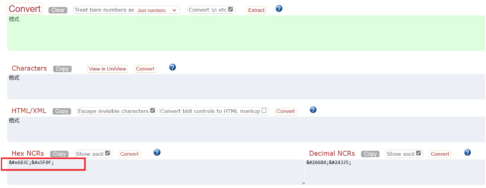

# PBIRS iFrame Embedding Guide

This document outlines how to embed Power BI Report Server (PBIRS) and SSRS reports using iframes, describes the authentication flow, and provides guidance on URL filtering and handling special characters.

---

## 1. PBIRS Embedding Methods

- **Using iframe**:  
  Applies to both Power BI (.pbix) and RDL reports.  [Embed a Power BI Report Server report using an iFrame in SharePoint Server - Power BI | Microsoft Learn](https://learn.microsoft.com/en-us/power-bi/report-server/quickstart-embed)
- **Using Report Viewer control**:  
  Applies to RDL reports.  [Get started with Report Viewer controls - SQL Server Reporting Services (SSRS) | Microsoft Learn](https://learn.microsoft.com/en-us/sql/reporting-services/application-integration/integrating-reporting-services-using-reportviewer-controls-get-started?view=sql-server-ver15)


## 2. Demo: Embedding a Report via iFrame in SharePoint Server

Example embed URL:
```html
<iframe width="800" height="600" src="http://dongsh955vm/Reports/powerbi/SQL_executionlog?rs:embed=true" frameborder="0" allowFullScreen="true"></iframe>
```

### Authentication Flow

1. **First authentication**: User authenticates to the SharePoint (SP) server.
2. **Second authentication**: User authenticates to the PBIRS server.
3. **Result**: The embedded report will then be displayed.


## 3. Filter Scenarios when using iframe

### RDL Reports

Add parameters to the URL for filtering: [URL access parameter reference - SQL Server Reporting Services (SSRS) | Microsoft Learn](https://learn.microsoft.com/en-us/sql/reporting-services/url-access-parameter-reference?view=sql-server-ver16)

Example:
```
http://dongsh955vm/ReportServer/Pages/ReportViewer.aspx?/SQLRDL_parameter&ReportParameter1=dbo
```

### Power BI Reports

Use query string parameters for filtering: [Filter a report using query string parameters in the URL - Power BI | Microsoft Learn](https://learn.microsoft.com/en-us/power-bi/collaborate-share/service-url-filters)

Example:
```
https://reportserver/reports/powerbi/Store Sales?rs:Embed=true&filter=Store/Territory eq 'NC' and Store/Chain eq 'Fashions Direct'
```


## 4. Handling Special Characters in Filters

For Power BI reports, Special characters, spaces, and leading numbers in table and column names require more formatting. When your query contains spaces, dashes, leading numbers, or other non-ASCII characters, prefix those special characters with an escape code starting with an underscore and an X (_x), then the four-digit Unicode, then another underscore. If the Unicode is fewer than four characters, you need to pad it with zeroes. refer to: [Filter a report using query string parameters in the URL - Power BI | Microsoft Learn](https://learn.microsoft.com/en-us/power-bi/collaborate-share/service-url-filters#special-characters-in-table-and-column-names)


such as in below example, we actually applied filter that "格式=RPL"
```
http://dongsh955vm/Reports/powerbi/SQL_executionlog?rs:Embed=true&&filter=ExecutionLog3/_x683C__x5F0F_ eq 'RPL'
```


AS for how to transfer the special characters, we could leverage [Unicode code converter (r12a.github.io)](https://r12a.github.io/app-conversion/), such as below:


Unicode example:  
`&#x683C;&#x5F0F;` → `_x683C__x5F0F_`


