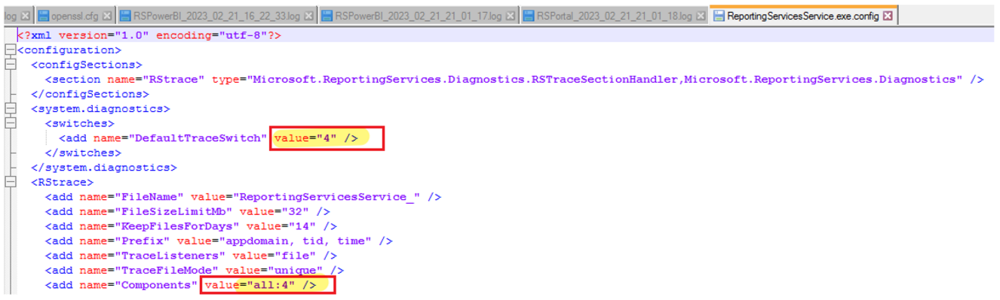
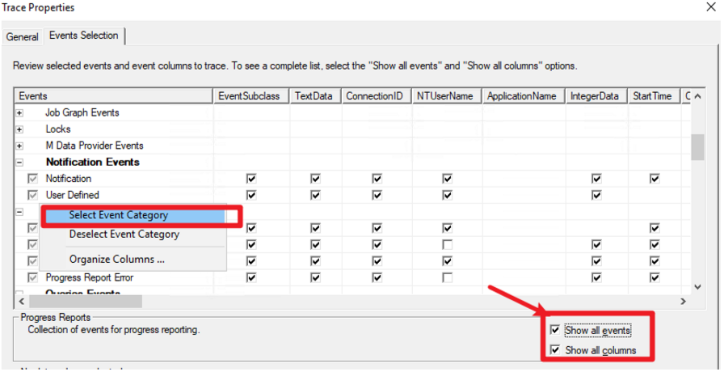

# PBIRS Log Collection Guide

This document outlines the recommended steps for collecting logs and traces to troubleshoot Power BI Report Server (PBIRS) issues, especially for PBI report rendering performance issues.

---

## 1. Browser Trace Collection

- Go to the PBIRS web portal.
- Click the "…" (more options) on the browser.
- Choose **More tools** → **Developer tools**.
- Switch to the **Network** tab (default is usually "Elements").
- Enable **Preserve log** and **Disable cache**.
- Open the report.
- Stop recording by clicking the red button and export the session data.


## 2. PBIRS Verbose Log Files

- Locate and edit the `ReportingServicesService.exe.config` file (default path: `C:\Program Files\Microsoft Power BI Report Server\PBIRS\ReportServer\bin`).

- For detailed logging, update the following configuration values:
  - Change `<add name="DefaultTraceSwitch" value="3" />` to `<add name="DefaultTraceSwitch" value="4" />`
  - Change `<add name="Components" value="all:3" />` to `<add name="Components" value="all:4" />`
  

  These changes increase the verbosity of PBIRS logs, capturing more detailed diagnostic information.

- After making these changes, restart the Report Server service to apply the new logging settings.

- Reproduce the issue you are troubleshooting.

- The verbose log files will be generated and stored in: `C:\Program Files\Microsoft Power BI Report Server\PBIRS\LogFiles`


## 3. Execution Log Files

- Use SSMS to connect to the PBIRS database.
- Run the following query (replace `ReportServer` with your DB name):

  ```sql
  select * from [ReportServer].dbo.ExecutionLog3
  order by TimeStart desc
  ```


## 4. SQL Server Profiler Trace

- On the PBIRS server, open SSMS.
- Go to **Tools** → **SQL Server Profiler**.
- File → New Trace.
- Choose "Analysis Services" and enter server name (for PBIRS, the SSAS is running on `localhost:5132`).
- In **Events Selection**, check "Show all events" and "Show all columns".
- Select all subevents under "Queries events", "Progress reports" and "Query processing" categories.
  
- Open the report in PBIRS portal.
- Save the recorded SQL Server Profiler trace.

> The `ActivityID` column in profiler events matches the `SessionID` from PBIRS logs.


## 5. Performance Monitor Trace

- Create a folder for logs (e.g., `E:\Carrie\PerfMonLogs`).
- Run CMD as administrator.
- Create the collection:

  ```cmd
  Logman create counter msperf -f bin -c "\LogicalDisk(*)\*" "\PhysicalDisk(*)\*" "\Processor(*)\*" "\Process(*)\*" "\Memory\*" "\Server\*" "\System\*" "\Paging File(*)\*" "\Objects\*" "\NBT Connection(*)\*" "\Network Interface(*)\*" "\Processor Information(*)\*" -si 00:00:01 -o E:\Carrie\PerfMonLogs\MS_perf_log.blg -cnf 24:00:00 -max 500
  ```

- Start the collection:

  ```cmd
  Logman start msperf
  ```

- Reproduce the issue (e.g., low memory warning in Resource Monitor).
- Capture screenshots and record the PID of the process with highest memory usage.
- To save process info to a text file:

  ```cmd
  wmic process get Processid,Name >> C:\processid.txt
  ```

- Stop the collection:

  ```cmd
  Logman stop msperf
  ```

---

Following these steps will help you gather comprehensive logs and traces for PBIRS troubleshooting and analysis.
