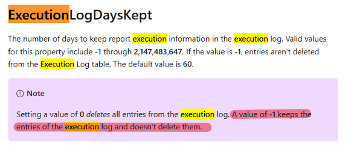
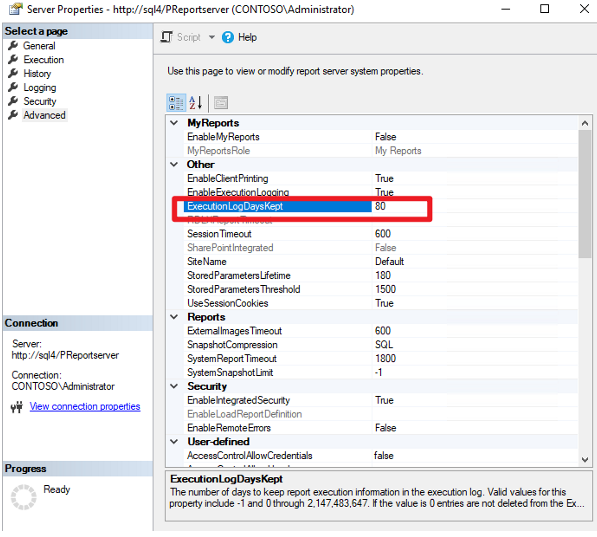
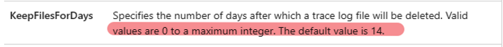
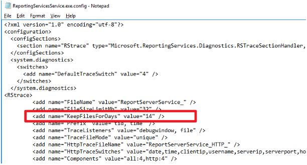

# PBIRS Log Retention and Log Directory Configuration

This guide summarizes log retention settings and how to customize log file locations for Power BI Report Server (PBIRS).

---

## 1. Execution Log Retention

- **Default retention:** 60 days  
  [Report Server ExecutionLog and the ExecutionLog3 View - SQL Server Reporting Services (SSRS) | Microsoft Learn](https://learn.microsoft.com/en-us/sql/reporting-services/tools/server-properties-advanced-page-reporting-services?view=sql-server-ver16)
 

- **Customization:**  
  In SSMS, connect to PBIRS, open server properties, and go to the Advanced page. we then could adjust the `ExecutionLogDaysKept` property. </br>
 


## 2. PBIRS default Log File Retention  (\LogFiles)

- **Default retention:** 14 days  
  [ReportingServicesService Configuration File - SQL Server Reporting Services (SSRS) | Microsoft Learn](https://learn.microsoft.com/en-us/sql/reporting-services/tools/server-properties-advanced-page-reporting-services?view=sql-server-ver16)
  

- **Customization:**  
  Edit the `KeepFilesForDays` value in the `ReportingServicesService.exe.config` file.
  


## 3. Change Log Directory Location

- **Trace log files:**  
  To change the location of logs stored in the LogFiles folder:
  1. Open `\ReportServer\bin\ReportingServicesService.exe.config`
  2. Add or modify the following line inside the `<RStrace>` section:
     ```xml
     <add name="Directory" value="U:\logs\" />
     ```
  3. Restart the RS service.

  **Note:** Not all log file types respect this change. The ReportingServicesWMI log files will not move to the new location.

- **RSTempFiles folder:**  
  To change the location of the RSTempFiles folder:
  1. Open `\ReportServer\web.config`
  2. Change the `tempDirectory` value:
     ```xml
     <compilation defaultLanguage="c#" debug="false" targetFramework="4.0" tempDirectory="C:\Program Files\Microsoft Power BI Report Server\PBIRS\ReportServer\RSTempFiles">
     ```
  3. Restart the RS service.


---
