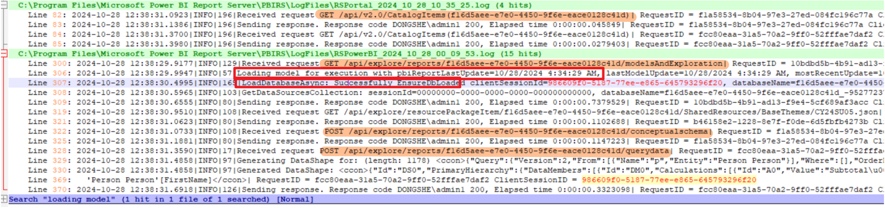
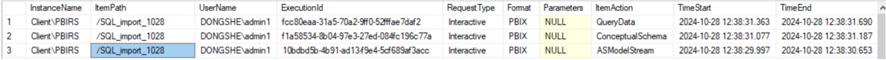

# PBIRS Power BI Report Opening Logic

## Brief Logic of Viewing a Power BI Report

1. **RSPortal** invokes API:  
   `GET /api/v2.0/CatalogItems(Path='/Location/PBIXName')`  to get Power BI report details.

2. **RSPowerBI** performs the following API calls:

   **a. Model Handling** 
   `POST /api/explore/reports/{ReportId}/modelsAndExploration`
   - Get PBIX components
   - Get database name
   - Get data source info
   - Invoke Analysis Services (AS) server to load database

   **b. Get Schema**  
   `POST /api/explore/reports/{ReportId}/conceptualschema`  Retrieves model metadata.

   **c. Query Data**  
   `POST /api/explore/reports/{ReportId}/querydata`  Invokes AS to execute the DAX query.

---

## Log overview

In PBIRS log files, Typically, we can use the Request ID (also referred to as the Execution ID in the execution log) to locate relevant entries in the PBIRS log files. This allows us to retrieve the associated ClientSessionID, which can then be used to trace and review all events that occurred within the same session.

Furthermore, we could also leverage execution log to check report rendering activities. the execution log typically reveals three distinct phases: AsModelStream, ConceptualSchema, and QueryData requests.

**Notes:**
- If the model is cached in Analysis Services and haven't been evicted or the report is using live connection mode, additional AsModelStream phases will not appear.
- Each rendering session includes exactly one ConceptualSchema request.
- There may be multiple QueryData requests depending on data retrieval needs.

**As for the meaning of each phase:**

- AsModelStream:
Retrieves the report definition from the Report Server’s Catalog table, including Model ID, report layout, and data connection details.

- ConceptualSchema:
Interprets the metadata of the data model. Returns an XMLA structure describing the model’s metadata. For live connections, connects directly to a remote SSAS instance.

- QueryData:
Handles data retrieval. The datashape engine generates queries to fetch data. The client sends four parallel QueryData requests; if more data is needed, another round of up to four requests may be sent. RSPowerBI serializes and returns the data to the client.

---

