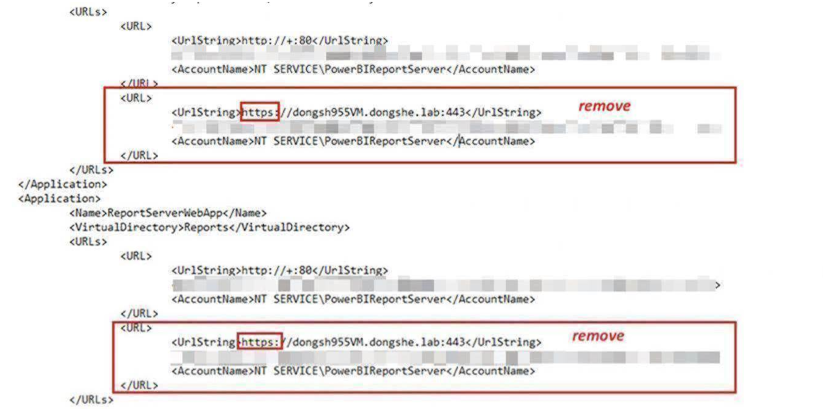
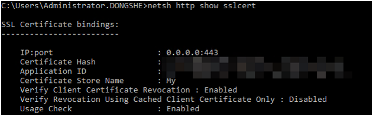
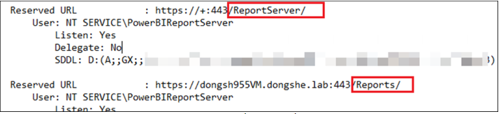
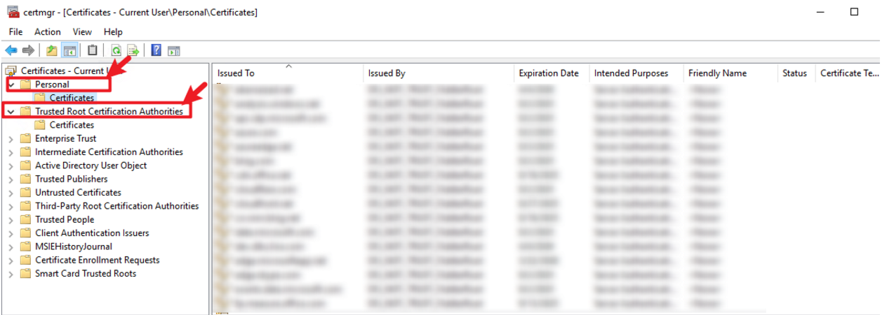
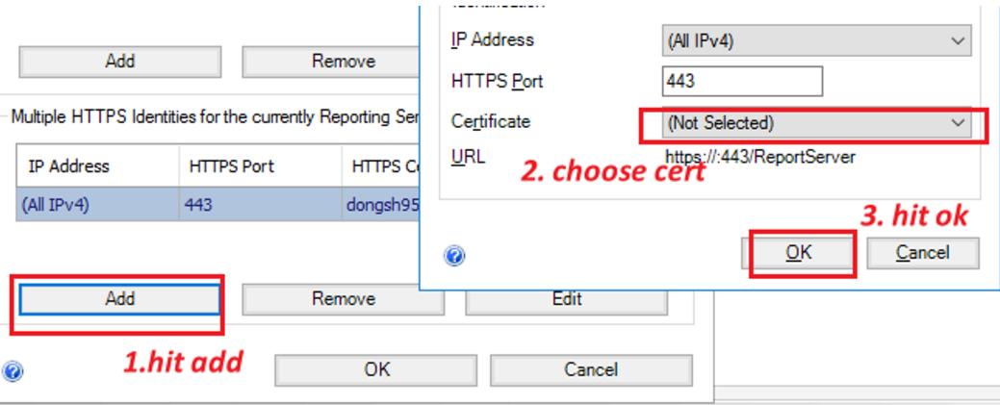

# Rebinding SSL Certificate in PBIRS

This guide outlines the steps required to properly rebind an SSL certificate for Power BI Report Server (PBIRS).

## Prerequisites for Certificate Binding

Ensure the certificate meets the following requirements:
- The certificate has to have a valid expiration date
- The certificate has to have a private key
- The certificate has to be Trusted
- The certificate needs to be created for Server Authentication
 
---

## Step-by-Step Rebinding Process

### 1. Remove Existing HTTPS Bindings

- Open **Report Server Configuration Manager** and remove any HTTPS URLs for both the Web Service and Web Portal.


### 2. Clean Configuration File

- Open the `rsreportserver.config` file (default path: `C:\Program Files\Microsoft Power BI Report Server\PBIRS\ReportServer\rsreportserver.config`).
- Ensure there are no HTTPS-related URLs present.



### 3. Clear SSL Bindings and URL Reservations

- Open **Command Prompt** as Administrator.

#### a. Clear SSL Bindings

- Run below command to view current SSL bindings.
  ```
  netsh http show sslcert
  ```
  

- If a binding exists on port 443, use below command to remove it:
  ```
  netsh http delete sslcert ipport=0.0.0.0:443
  ```

#### b. Clear URL Reservations

- Run below command to export current URL reservations.
  ```
  netsh http show urlacl >C:\urlacl.txt
  ```
  

- Delete reserved URLs (those starting with `https` and ending with `/Reports`, `/ReportServer`, `/wopi`, or `/PowerBI`):
  ```cmd
  netsh http delete urlacl https://dongsh955VM.dongshe.lab:443/Reports/
  netsh http delete urlacl https://dongsh955VM.dongshe.lab:443/ReportServer/
  netsh http delete urlacl https://dongsh955VM.dongshe.lab:443/wopi/
  netsh http delete urlacl https://dongsh955VM.dongshe.lab:443/PowerBI/
  ```


---

### 4. Install and Rebind the New Certificate

- Install the new certificate into both the **Trusted Root CA Store** and the **Personal Store**. PBIRS will automatically detect certificates installed in the personal store.

- To manage certificates, open the MMC console:
  - Press `Win + R`, type `certmgr.msc`, and press Enter.




---

Follow these steps to ensure a clean and secure SSL certificate binding for PBIRS.
