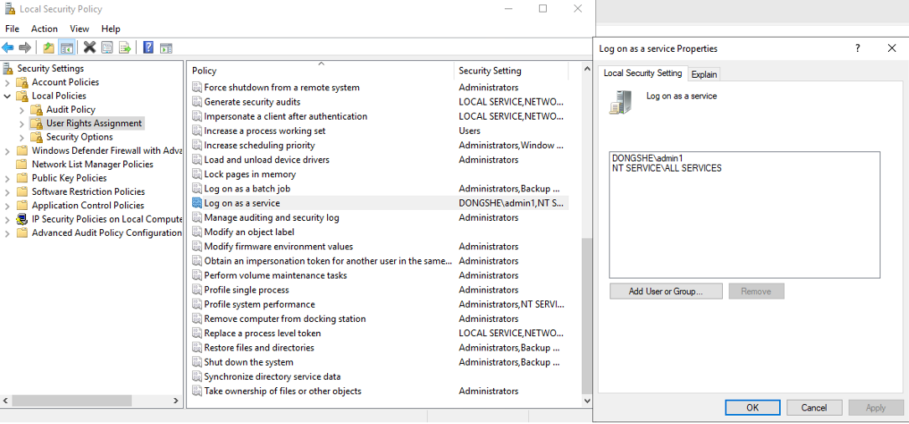
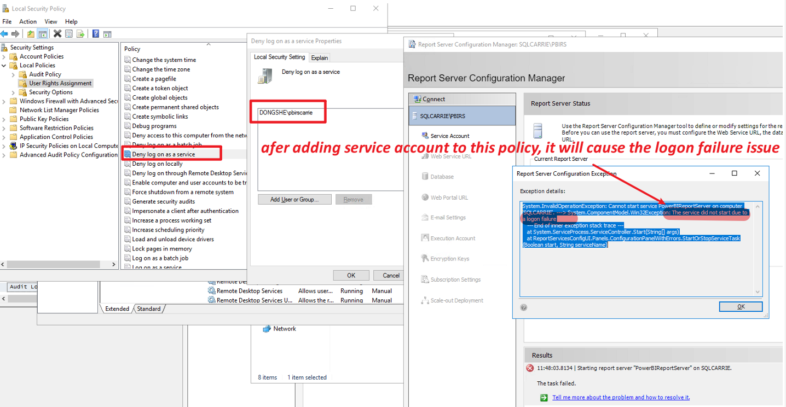

# PBIRS Service Account Logon Permission

To ensure Power BI Report Server (PBIRS) can start successfully, the PBIRS service account must be granted permission to log on as a service and must not be denied this right.

---

## How to Check and Configure Logon Permission

1. Open the Run dialog (`Win + R`), enter `secpol.msc` to open **Local Security Policy**.
2. Navigate to: `Security Settings` → `Local Policies` → `User Rights Assignment`
3. Ensure the PBIRS service account is included in the **Log on as a service** policy group.

## Important Note

If the service account is added to the **Deny log on as a service** policy, PBIRS will fail to start and you will encounter a logon failure error.

---

Always verify these settings to avoid service startup issues for PBIRS.
