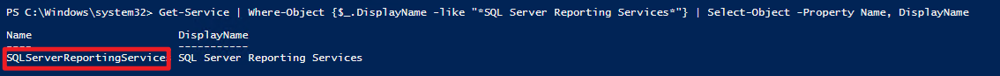

# Use PowerShell to Stop and Start SSRS

This guide demonstrates how to use PowerShell to identify the SQL Server Reporting Services (SSRS) service name and automate stopping and starting the service.

---

## 1. Get the Service Name of SSRS

Use the following PowerShell command to find the SSRS service name:

```powershell
Get-Service | Where-Object {$_.DisplayName -like "*SQL Server Reporting Services*"} | Select-Object -Property Name, DisplayName
```




## 2. Stop and Start the SSRS Service

Use the following PowerShell script to stop and then start the SSRS service:

```powershell
# Stop SSRS
Stop-Service -Name "SQLServerReportingServices"

# Wait for a few seconds
Start-Sleep -Seconds 10

# Start SSRS
Start-Service -Name "SQLServerReportingServices"
```

---

This approach is useful for automating SSRS maintenance tasks or troubleshooting service issues.
