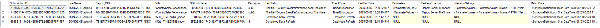
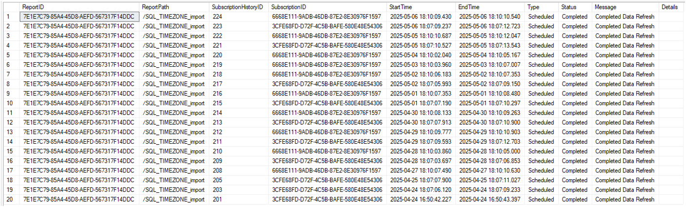
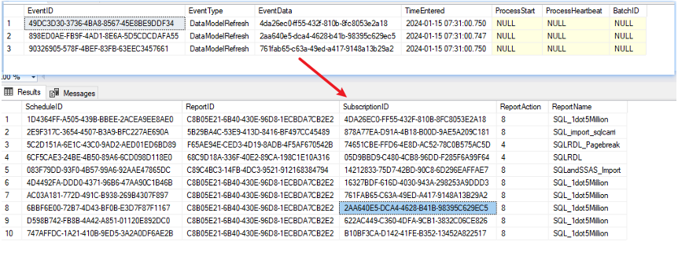
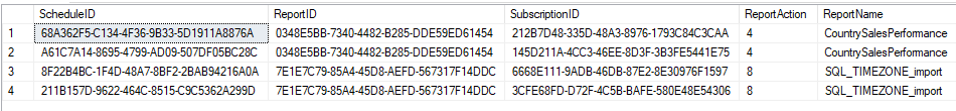
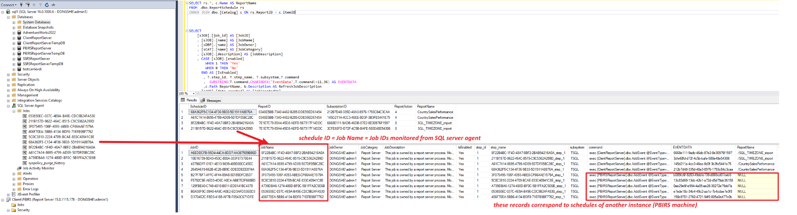
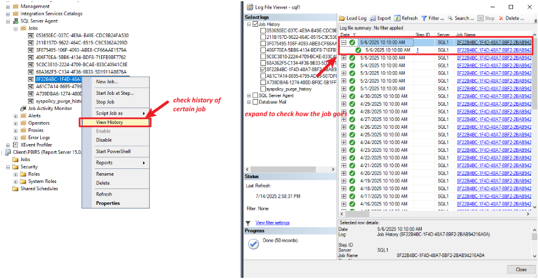
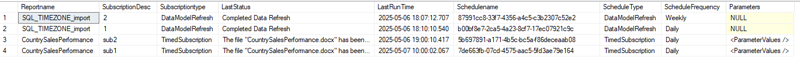

# Useful Queries to Check PBIRS/SSRS Refresh and Subscription Information in SSMS

This guide provides a set of SQL queries to help you audit and troubleshoot refresh schedules, subscriptions, job history, and related metadata in Power BI Report Server (PBIRS) or SQL Server Reporting Services (SSRS) using SQL Server Management Studio (SSMS).

---

## 1. Check Subscription and Refresh Information

Retrieve details about report subscriptions, including owner, report path, job name, status, and delivery settings.

```sql
SELECT s.[SubscriptionID], u.UserName, s.[Report_OID], c.Path, rs.ScheduleID AS SQLJobName,
       s.[Description], s.[LastStatus], s.[EventType], s.[LastRunTime], s.[Parameters],
       s.[DeliveryExtension], s.[ExtensionSettings], s.[MatchData]
FROM [dbo].[Subscriptions] AS s
LEFT JOIN dbo.Users AS u ON s.OwnerID = u.UserID
LEFT JOIN dbo.Catalog AS c ON c.ItemID = s.Report_OID
LEFT JOIN dbo.ReportSchedule AS rs ON rs.SubscriptionID = s.SubscriptionID
```

---

## 2. Check Refresh History

View the refresh history for data model. Note: Only the last status is saved for subscriptions; refresh history is not persisted for subscriptions.

```sql
SELECT c.ItemID AS ReportID, c.Path AS ReportPath, sh.SubscriptionHistoryID, sh.SubscriptionID,
       sh.StartTime, sh.EndTime,
       CASE (sh.Type) WHEN 0 THEN 'Scheduled' WHEN 1 THEN 'OnDemand' ELSE CONVERT(varchar(5), sh.Type) END AS Type,
       CASE (sh.Status) WHEN 0 THEN 'Completed' WHEN 1 THEN 'InProgress' WHEN 2 THEN 'Failed' ELSE CONVERT(varchar(5), sh.Status) END AS Status,
       sh.Message, sh.Details
FROM Catalog c
INNER JOIN Subscriptions s ON c.ItemID = s.Report_OID
INNER JOIN SubscriptionHistory sh ON s.SubscriptionID = sh.SubscriptionID
ORDER BY sh.StartTime DESC
```


---

## 3. Check Pending Tasks in the Event Table

List pending events that have not yet been picked up for execution. The `EventData` column in the Event table corresponds to the Subscription ID.

```sql
SELECT * FROM [ReportServer].[dbo].[Event]
```


---

## 4. Check Schedule Information

Get schedule details for reports, including the report name，schedule ID, etc.

```sql
SELECT rs.*, c.Name AS ReportName
FROM dbo.ReportSchedule rs
INNER JOIN dbo.[Catalog] c ON rs.ReportID = c.ItemID
```

---

## 5. Check Job Information and Job History

Both scheduled refreshes and subscriptions create SQL Agent jobs named after the Schedule ID. The following query provides job metadata and running history.

```sql
SELECT
    [sJOB].[job_id] AS [JobID],
    [sJOB].[name] AS [JobName],
    [sDBP].[name] AS [JobOwner],
    [sCAT].[name] AS [JobCategory],
    [sJOB].[description] AS [JobDescription],
    CASE [sJOB].[enabled] WHEN 1 THEN 'Yes' WHEN 0 THEN 'No' END AS [IsEnabled],
    T.step_id, T.step_name, T.subsystem, T.command,
    SUBSTRING(T.command, CHARINDEX('EventData', T.command)+11,36) AS EVENTDATA,
    c.Path AS ReportName, b.Description AS RefreshJobDescription,
    [sJOB].[date_created] AS [JobCreatedOn],
    [sJOB].[date_modified] AS [JobLastModifiedOn],
    [sSVR].[name] AS [OriginatingServerName],
    [sJSTP].[step_id] AS [JobStartStepNo],
    [sJSTP].[step_name] AS [JobStartStepName],
    CASE WHEN [sSCH].[schedule_uid] IS NULL THEN 'No' ELSE 'Yes' END AS [IsScheduled],
    [sSCH].[schedule_uid] AS [JobScheduleID],
    [sSCH].[name] AS [JobScheduleName],
    CASE [sJOB].[delete_level]
        WHEN 0 THEN 'Never'
        WHEN 1 THEN 'On Success'
        WHEN 2 THEN 'On Failure'
        WHEN 3 THEN 'On Completion'
    END AS [JobDeletionCriterion]
FROM [msdb].[dbo].[sysjobs] AS [sJOB]
LEFT JOIN [msdb].[sys].[servers] AS [sSVR] ON [sJOB].[originating_server_id] = [sSVR].[server_id]
LEFT JOIN [msdb].[dbo].[syscategories] AS [sCAT] ON [sJOB].[category_id] = [sCAT].[category_id]
LEFT JOIN [msdb].[dbo].[sysjobsteps] AS [sJSTP] ON [sJOB].[job_id] = [sJSTP].[job_id] AND [sJOB].[start_step_id] = [sJSTP].[step_id]
LEFT JOIN [msdb].[sys].[database_principals] AS [sDBP] ON [sJOB].[owner_sid] = [sDBP].[sid]
LEFT JOIN [msdb].[dbo].[sysjobschedules] AS [sJOBSCH] ON [sJOB].[job_id] = [sJOBSCH].[job_id]
LEFT JOIN [msdb].[dbo].[sysschedules] AS [sSCH] ON [sJOBSCH].[schedule_id] = [sSCH].[schedule_id]
LEFT JOIN msdb.dbo.sysjobsteps T ON sJOB.job_id = T.job_id
LEFT JOIN dbo.Subscriptions b ON SUBSTRING(T.command,CHARINDEX('EventData',T.command)+11,36) = b.SubscriptionID
LEFT JOIN dbo.Catalog c ON b.Report_OID = c.ItemID
WHERE [sCAT].[name] LIKE '%Report Server%'
ORDER BY [JobName]
```


To search job history for a specific job, we could follow below steps:


---

## 6. Get Dataset and Subscription Refresh Frequency, Cache, and Last Status

This advanced query provides a readable schedule, frequency, and last status for dataset and subscription refreshes.

```sql
SELECT Reportname = c.Name 
      ,SubscriptionDesc=su.Description 
      ,Subscriptiontype=su.EventType 
      ,su.LastStatus 
      ,su.LastRunTime 
      ,Schedulename=sch.Name 
      ,ScheduleType = sch.EventType 
      ,ScheduleFrequency = 
       CASE sch.RecurrenceType 
       WHEN 1 THEN 'Once' 
       WHEN 2 THEN 'Hourly' 
       WHEN 3 THEN 'Daily'
          WHEN 4 THEN 'Weekly'
       WHEN 5 THEN 'Monthly' 
       END 
       ,su.Parameters 
  FROM dbo.Subscriptions su 
  JOIN dbo.Catalog c 
    ON su.Report_OID = c.ItemID 
  JOIN dbo.ReportSchedule rsc 
    ON rsc.ReportID = c.ItemID 
   AND rsc.SubscriptionID = su.SubscriptionID 
  JOIN dbo.Schedule Sch 
ON rsc.ScheduleID = sch.ScheduleID
--where LastStatus ='pending'
order by LastRunTime
```



---

Use these queries to efficiently monitor, audit, and troubleshoot refresh and subscription activities in your PBIRS or SSRS environment.
