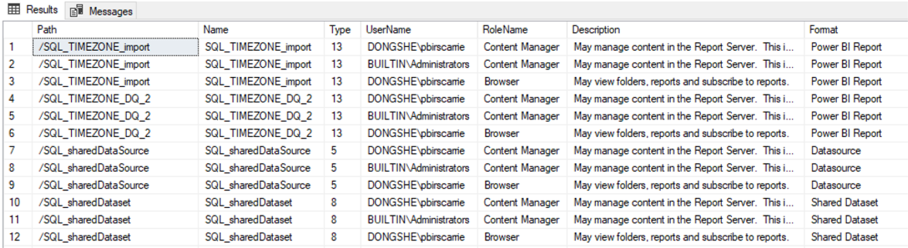

# Useful Query to Check Report Server User Permissions in SSMS

To efficiently review user permissions and roles within SQL Server Reporting Services (SSRS) or Power BI Report Server (PBIRS), you can use the following SQL query in SQL Server Management Studio (SSMS). This query provides a comprehensive overview of user access, including item type, user name, role, and description.

## Query Example

```sql
SELECT 
    a.Path,
    a.Name,
    a.Type,
    c.UserName,
    d.RoleName,
    d.Description,
    CASE
        WHEN a.Type = 1 THEN 'Folder'
        WHEN a.Type = 2 THEN 'SSRS Paginated Report'
        WHEN a.Type = 3 THEN 'File'
        WHEN a.Type = 4 THEN 'Linked Report'
        WHEN a.Type = 5 THEN 'Datasource'
        WHEN a.Type = 6 THEN 'Model'
        WHEN a.Type = 8 THEN 'Shared Dataset'
        WHEN a.Type = 9 THEN 'Report Part'
        WHEN a.Type = 11 THEN 'KPI'
        WHEN a.Type = 12 THEN 'SSRS Mobile Report'
        WHEN a.Type = 13 THEN 'Power BI Report'
        ELSE 'Unknown'
    END AS Format
FROM [dbo].[Catalog] a
LEFT JOIN dbo.PolicyUserRole b ON a.PolicyID = b.PolicyID
LEFT JOIN dbo.Users c ON b.UserID = c.UserID
LEFT JOIN dbo.Roles d ON b.RoleID = d.RoleID
```

This query joins the Catalog, PolicyUserRole, Users, and Roles tables to display:

- **Path**: The location of the item in the report server.
- **Name**: The name of the item.
- **Type**: The numeric type code of the item.
- **UserName**: The user assigned to the item.
- **RoleName**: The role granted to the user.
- **Description**: Details about the role.
- **Format**: A readable label for the item type.

## Sample Output

The result set will show which users have access to which items, their roles, and the type of report server object. This is especially useful for auditing permissions or troubleshooting access issues.



---

Use this query to quickly audit and manage user permissions in your PBIRS or SSRS environment.
