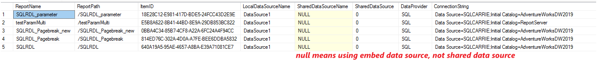

# Useful Queries to Check Report Data Sources in PBIRS/SSRS

This guide provides practical queries and Power Query (M) scripts to help you audit and extract data source information for reports in Power BI Report Server (PBIRS) or SQL Server Reporting Services (SSRS).

---

## 1. SSMS Data Source DMV Query

The following T-SQL query allows you to enumerate all data sources used by SSRS reports, including both embedded and shared data sources. It provides details such as report name, path, data provider, and connection string.

```sql
WITH CatalogWithXml AS (
    SELECT *,
         ContentXml = (CONVERT(XML, CONVERT(VARBINARY(MAX), Content)))
    FROM Catalog
),
SharedDataSources AS (
    SELECT ds.ItemID,
        SharedDataSourceName = c.Name,
        LocalDataSourceName = ds.Name,
        DataProvider = ContentXML.value('(/*:DataSourceDefinition/*:Extension)[1]', 'NVARCHAR(260)'),
        ConnectionString = ContentXML.value('(/*:DataSourceDefinition/*:ConnectString)[1]', 'NVARCHAR(MAX)')
    FROM DataSource ds
        JOIN CatalogWithXml c ON ds.Link = c.ItemID
),
AllDataSources AS (
    SELECT r.Name as ReportName,
           r.Path as ReportPath,
           r.ItemID,
           r.LocalDataSourceName,
           sds.SharedDataSourceName,
           SharedDataSource = CAST ((CASE WHEN sds.SharedDataSourceName IS NOT NULL THEN 1 ELSE 0 END) AS BIT),
           DataProvider = ISNULL(r.DataProvider, sds.DataProvider),
           ConnectionString = ISNULL(r.ConnectionString, sds.ConnectionString)
    FROM (
        SELECT c.*,
                LocalDataSourceName = DataSourceXml.value('@Name', 'NVARCHAR(260)'),
                DataProvider = DataSourceXml.value('(*:ConnectionProperties/*:DataProvider)[1]', 'NVARCHAR(260)'),
                ConnectionString = DataSourceXml.value('(*:ConnectionProperties/*:ConnectString)[1]', 'NVARCHAR(MAX)')
            FROM CatalogWithXml c
                CROSS APPLY ContentXml.nodes('/*:Report/*:DataSources/*:DataSource') DataSource(DataSourceXml)
        ) r
        LEFT JOIN SharedDataSources sds ON r.ItemID = sds.ItemID AND r.LocalDataSourceName = sds.LocalDataSourceName
)
SELECT * FROM AllDataSources
```

This query helps you quickly identify which reports use embedded data sources and which use shared data sources, along with their connection details.



---

## 2. Use Power BI OData Feed to Get Data Source / Connection String

You can also use Power Query (M) scripts to extract data source and connection string information via the PBIRS/SSRS OData API.

### For RDL Reports

Use the following Power Query script with the `/reports/api/v2.0/Reports` endpoint:

```powerquery
let
    Source = OData.Feed("http://sqlcarrie/reports/api/v2.0/Reports", null, [Implementation="2.0"]),
    #"Expanded DataSources" = Table.ExpandTableColumn(Source, "DataSources", {"Id", "ModifiedBy", "ModifiedDate", "ConnectionString", "DataModelDataSource"}, {"DataSources.Id", "DataSources.ModifiedBy", "DataSources.ModifiedDate", "DataSources.ConnectionString", "DataSources.DataModelDataSource"}),
    #"Expanded DataSources.DataModelDataSource" = Table.ExpandRecordColumn(#"Expanded DataSources", "DataSources.DataModelDataSource", {"Type", "Kind", "AuthType", "Username", "ModelConnectionName"}, {"DataSources.DataModelDataSource.Type", "DataSources.DataModelDataSource.Kind", "DataSources.DataModelDataSource.AuthType", "DataSources.DataModelDataSource.Username", "DataSources.DataModelDataSource.ModelConnectionName"}),
    #"Added Conditional Column" = Table.AddColumn(#"Expanded DataSources.DataModelDataSource", "DS.Connection_String", each if [DataSources.ConnectionString] = null then "No Data Source" else [DataSources.ConnectionString]),
    #"Removed Columns" = Table.RemoveColumns(#"Added Conditional Column",{"CacheRefreshPlans", "AccessToken", "Roles", "ContentType", "ParentFolder", "Properties", "Comments", "AlertSubscriptions", "AllowedActions", "Policies", "DependentItems","Id", "ParentFolderId", "DataSources.Id", "DataSources.DataModelDataSource.ModelConnectionName"}),
    #"Renamed Columns" = Table.RenameColumns(#"Removed Columns",{{"DataSources.ConnectionString", "DS.ConnectionString"}, {"DataSources.DataModelDataSource.Type", "DS.Type"}, {"DataSources.DataModelDataSource.Kind", "DS.Kind"}, {"DataSources.DataModelDataSource.AuthType", "DS.AuthType"}, {"DataSources.DataModelDataSource.Username", "DS.Username"}, {"DataSources.ModifiedBy", "DS.ModifiedBy"}, {"DataSources.ModifiedDate", "DS.ModifiedDate"}, {"Name", "Report"}, {"Path", "Report Path"}}),
    #"Added Custom" = Table.AddColumn(#"Renamed Columns", "ContentSizeMB", each [Size]/(1024*1024))
in
    #"Added Custom"
```

---

### For Power BI Reports

Use the following Power Query script with the `/reports/api/v2.0/PowerBIReports` endpoint:

```powerquery
let
    Source = OData.Feed("http://dongsh955vm/reports/api/v2.0/PowerBIReports", null, [Implementation="2.0"]),
    #"Expanded DataSources" = Table.ExpandTableColumn(Source, "DataSources", {"Id", "ModifiedBy", "ModifiedDate", "ConnectionString", "DataModelDataSource"}, {"DataSources.Id", "DataSources.ModifiedBy", "DataSources.ModifiedDate", "DataSources.ConnectionString", "DataSources.DataModelDataSource"}),
    #"Expanded DataSources.DataModelDataSource" = Table.ExpandRecordColumn(#"Expanded DataSources", "DataSources.DataModelDataSource", {"Type", "Kind", "AuthType", "Username", "ModelConnectionName"}, {"DataSources.DataModelDataSource.Type", "DataSources.DataModelDataSource.Kind", "DataSources.DataModelDataSource.AuthType", "DataSources.DataModelDataSource.Username", "DataSources.DataModelDataSource.ModelConnectionName"}),
    #"Added Conditional Column" = Table.AddColumn(#"Expanded DataSources.DataModelDataSource", "DS.Connection_String", each if [DataSources.ConnectionString] = null then "No Data Source" else [DataSources.ConnectionString]),
    #"Removed Columns" = Table.RemoveColumns(#"Added Conditional Column",{"CacheRefreshPlans", "AccessToken", "Roles", "ContentType", "ParentFolder", "Properties", "Comments", "AlertSubscriptions", "AllowedActions", "Policies", "DependentItems","Id", "ParentFolderId", "DataSources.Id", "DataSources.DataModelDataSource.ModelConnectionName"}),
    #"Renamed Columns" = Table.RenameColumns(#"Removed Columns",{{"DataSources.ConnectionString", "DS.ConnectionString"}, {"DataSources.DataModelDataSource.Type", "DS.Type"}, {"DataSources.DataModelDataSource.Kind", "DS.Kind"}, {"DataSources.DataModelDataSource.AuthType", "DS.AuthType"}, {"DataSources.DataModelDataSource.Username", "DS.Username"}, {"DataSources.ModifiedBy", "DS.ModifiedBy"}, {"DataSources.ModifiedDate", "DS.ModifiedDate"}, {"Name", "Report"}, {"Path", "Report Path"}}),
    #"Added Custom" = Table.AddColumn(#"Renamed Columns", "ContentSizeMB", each [Size]/(1024*1024))
in
    #"Added Custom"
```

---

These queries and scripts allow you to efficiently audit and extract data source information for both SSRS and Power BI reports, helping you manage and troubleshoot data connectivity in your reporting environment.


