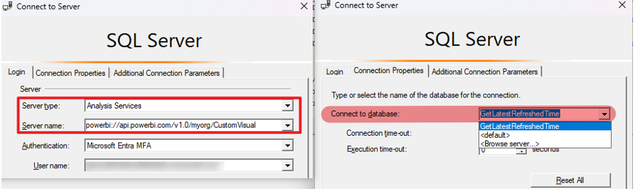
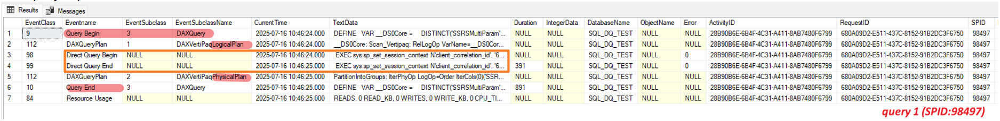
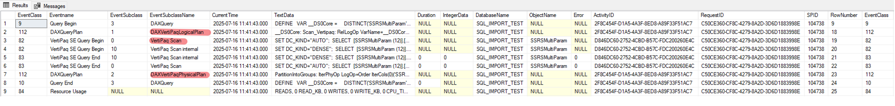

# Open Report AS Profiler Trace Track

## Overview

When opening a report using Import mode or DirectQuery (DQ) mode, you can capture a profiler trace against the semantic model residing in a premium workspace.  

To do this, open SSMS, choose SQL Server Profiler under Tools, and connect to Analysis Services via the XMLA endpoint.  
**Note:** We must specify which dataset/database to connect to.



For details on which AS events to check, refer to: [PBIRS log collection.md](../PBIRS_SSRS/PBIRS%20log%20collection.md).

---

## Events Order Logic

Below is the sequence of events recorded in a Profiler trace during report rendering. Each row shows the eventclass and eventsubclass.

### DirectQuery Mode

During DirectQuery Begin and DirectQuery End phases, Power BI sends the query directly to the data source, which executes the query and returns the result.

| Query Begin                 | 3-DAX query                  |                       |                       |
|-----------------------------|------------------------------|-----------------------|-----------------------|
|                             | DAX query plan               | 1-DAXvertipaqLogicalPlan |                       |
|                             |                              |                           | Direct Query Begin     |
|                             |                              |                           | Direct Query End     |
|                             | DAX query plan               | 2-DAXvertipaqPhysicalPlan |                     |
| Query End                   | 3-DAX query                  |                       |                       |

### Import Mode

When opening a report using Import mode, Power BI does not interact with the data source.

| Query Begin                 | 3-DAX query                  |                           |                           |
|-----------------------------|------------------------------|---------------------------|---------------------------|
|                             | DAX query plan               | 1-DAXvertipaqLogicalPlan  |                           |
|                             |                              | Vertipaq SE query Begin   | 0-vertipaqScan            |
|                             |                              |                           | 10-VertipaqScan Internal  |
|                             |                              | Vertipaq SE query End     | 10-VertipaqScan Internal  |
|                             |                              |                           | 0-vertipaqScan            |
|                             | DAX query plan               | 2-DAXvertipaqPhysicalPlan |                           |
| Query End                   | 3-DAX query                  |                           |                           |

---

## Log Overview

### DQ Mode

**DAX query in profiler trace:**
```dax
DEFINE
    VAR __DS0Core = 
        DISTINCT('SSRSMultiParam'[Country])
    VAR __DS0PrimaryWindowed = 
        TOPN(501, __DS0Core, 'SSRSMultiParam'[Country], 1)
EVALUATE
    __DS0PrimaryWindowed
ORDER BY
    'SSRSMultiParam'[Country]

<PropertyList xmlns="urn:schemas-microsoft-com:xml-analysis" xmlns:soap="http://schemas.xmlsoap.org/soap/envelope/"><Catalog>f147f11b-a77e-4d5a-a040-8a7f2d1e58ed</Catalog><Timeout>225</Timeout><Format>Native</Format><MaximumRows>-1</MaximumRows><DbpropMsmdFlattened2>false</DbpropMsmdFlattened2><DbpropMsmdOptimizeResponse>9</DbpropMsmdOptimizeResponse><DbpropMsmdActivityID>3cda7724-c284-4e2f-be2c-4af5c39a6de9</DbpropMsmdActivityID><DbpropMsmdRequestID>3cda7724-c284-4e2f-be2c-4af5c39a6de9</DbpropMsmdRequestID><DbpropMsmdCurrentActivityID>b66f9d62-da53-4ad8-97c9-d6570a3ec72a</DbpropMsmdCurrentActivityID><DbpropMsmdExecutionMetrics>1</DbpropMsmdExecutionMetrics><ApplicationContext>{"DatasetId":"f147f11b-a77e-4d5a-a040-8a7f2d1e58ed","Sources":[{"ReportId":"b797f9f6-1293-47b1-8c02-7b4cd5adc266","VisualId":"6363eb566cef71859d4b","HostProperties":{"ConsumptionMethod":"Power BI Web App","UserSession":"48c6ab35-e49f-4d27-b5d5-84025fd866a4"}}]}</ApplicationContext><LocaleIdentifier>1033</LocaleIdentifier><EffectiveUserName>admin@XXXXX.onmicrosoft.com</EffectiveUserName><localeidentifier>1033</localeidentifier><sspropinitappname>PowerBI</sspropinitappname></PropertyList>

```


**DAX query retrieved from Performance Analyzer:**
```dax
// DAX Query
DEFINE
    VAR __DS0Core = 
        DISTINCT('SSRSMultiParam'[Country])

    VAR __DS0PrimaryWindowed = 
        TOPN(501, __DS0Core, 'SSRSMultiParam'[Country], 1)

EVALUATE
    __DS0PrimaryWindowed

ORDER BY
    'SSRSMultiParam'[Country]


// Direct Query

SELECT 
TOP (501) [t0].[Country]
FROM 
(
(
select [$Table].[Country] as [Country],
    [$Table].[Region] as [Region],
    [$Table].[Value] as [Value]
from [dbo].[SSRSMultiParam] as [$Table]
)
)
 AS [t0]
GROUP BY [t0].[Country]
ORDER BY [t0].[Country]
ASC
```

**Data source query captured from data source:**
```sql
EXEC sys.sp_set_session_context N'client_correlation_id', '680A09D2-E511-437C-8152-91B2DC3F6750';
SELECT TOP (501) [t0].[Country]
FROM (
    select [$Table].[Country] as [Country],
           [$Table].[Region] as [Region],
           [$Table].[Value] as [Value]
    from [dbo].[SSRSMultiParam] as [$Table]
) AS [t0]
GROUP BY [t0].[Country]
ORDER BY [t0].[Country] ASC
OPTION (
    LABEL = N'{"DatasetId":"f147f11b-a77e-4d5a-a040-8a7f2d1e58ed","Sources":[{"ReportId":"b797f9f6-1293-47b1-8c02-7b4cd5adc266","VisualId":"6363eb566cef71859d4b"}]}'
);
EXEC sys.sp_set_session_context N'client_correlation_id', NULL;
```
The query captured from the data source matches the DirectQuery statement observed in the AS profiler trace against the semantic model.

---

### Import Mode

**DAX query in Performance Analyzer:**
```dax
// DAX Query
DEFINE
    VAR __DS0Core = 
        DISTINCT('SSRSMultiParam'[Country])

    VAR __DS0PrimaryWindowed = 
        TOPN(501, __DS0Core, 'SSRSMultiParam'[Country], 1)

EVALUATE
    __DS0PrimaryWindowed

ORDER BY
'SSRSMultiParam'[Country]
```

**AS profiler trace:**  




