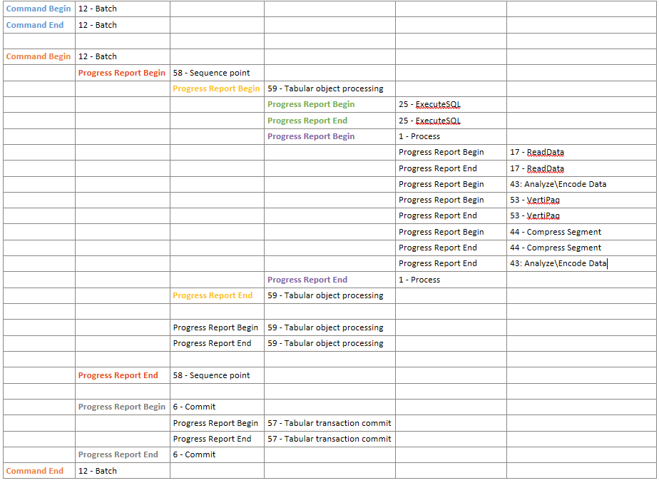
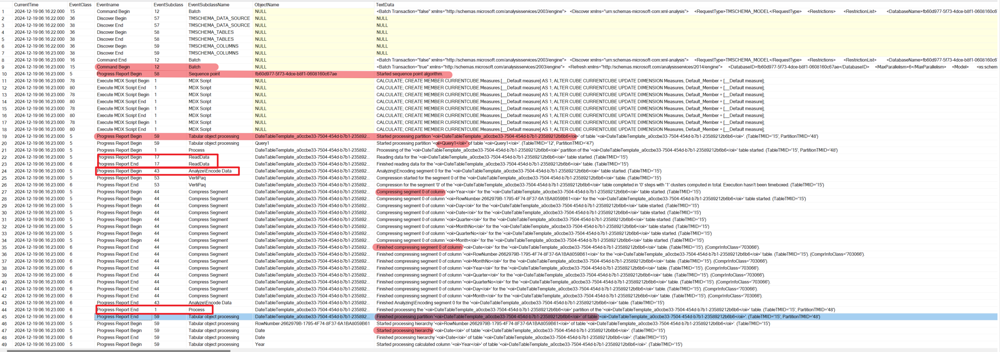
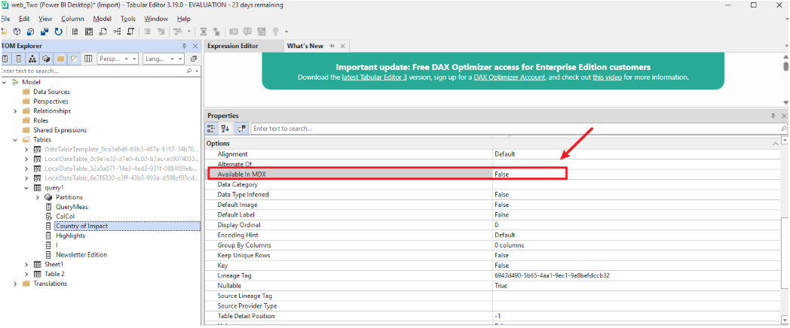
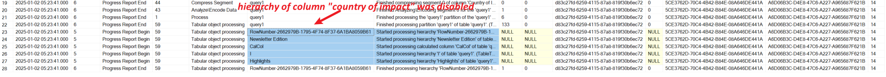

# Tabular Model Refresh Logic

## Overview

PBI semantic models are tabular models. We can process a full refresh against the tabular model and use SQL Server Profiler to capture traces against Analysis Services (AS).

- For SSAS, trace directly against the AS instance/server.
- For PBI Premium workspace, treat the XMLA endpoint as the PBI Premium AS server name and capture the corresponding traces. For more details, refer to: [Use SSMS to connect to PBI premium workspace.md](../PBI/Use%20SSMS%20to%20connect%20to%20PBI%20premium%20workspace.md).

## AS Events of Refresh

By default, each table is a partition, unless we set incremental refresh policy or custom partitions. the sequence point algorithm runs only once. 

Below is a table of events recorded in a Profiler trace of a full model refresh. Each row shows the eventclass and eventsubclass.  
For more AS trace events, see: [Analysis Services Trace Events | Microsoft Learn](https://learn.microsoft.com/en-us/analysis-services/trace-events/analysis-services-trace-events?view=sql-analysis-services-2025)

## Key Phase Explanation

- **59 - Tabular object processing**: contains the following objects:
  - Started processing partition  
  - Started processing calculated column  
  - Started processing hierarchy  
  - Started processing relationship

- **25 - ExecuteSQL**:  
  SQL or M query executed to retrieve data.

- **17 - ReadData**:  
  AS engine starts reading data (streaming process, namely Gateway streams data into PBI service).  
  - For every 10,000 rows, AS engine generates a Progress Report Current event.
  - The `IntegerData` column of the Progress Report End event contains the exact number of rows read by AS Engine from the data source for one partition.

## Profiler Trace Observations

We can observe the sequence and details of each processing phase in the Profiler trace against AS. 

  

## Disable Unnecessary Hierarchy Processing

In tabular models, hierarchies are metadata that define relationships between two or more columns in a table.

- Every column of each table by default has a hierarchy processed.
- Use the `isAvailableInMDX` property to stop attribute hierarchies from being built on columns when not needed. See: [Chris Webb's BI Blog: How The New IsAvailableInMDX Property For Analysis Services Tabular Can Reduce Memory Usage And Speed Up Processing](https://blog.crossjoin.co.uk/2018/07/02/isavailableinmdx-ssas-tabular/)

**Example:**  
  In the table editor, for the column `country of impact`, set the `AvailableInMDX` property to `false`.

  

  During refresh, we could see that the hierarchy for the column is disabled by checking the AS Profiler trace.

  

---

